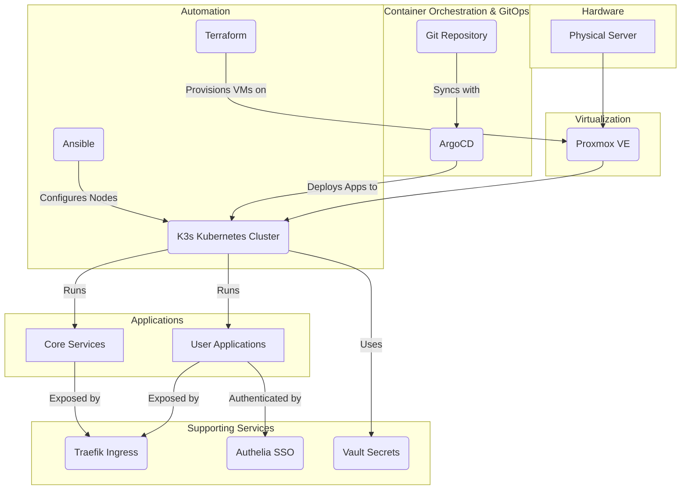

# Homelabeazy - Your _Homelab as Code_

<div align="center">
    
</div>

## Project Mission

To bring enterprise-grade automation to the personal homelab. This project provides a complete blueprint to build a powerful, reproducible server environment using professional Infrastructure as Code (IaC) and GitOps practices, allowing you to manage your entire homelab with the same reliability and control as a modern software project.

### Details

This project automates the setup of a homelab environment on a Proxmox server using a combination of:

* **Terraform**
* **Ansible**
* **ArgoCD**.

It:

1. **provisions a K3s cluster**
1. **configures the nodes**
1. **and deploys a suite of applications using a GitOps approach.**

The project is designed to be idempotent and modular, allowing you to easily customize your homelab by adding or removing applications to fit your needs.

## Architecture Diagram



## Prerequisites

Before you begin, you will need the following:

-   A **Proxmox server** with a cloud-init template for your desired operating system.
-   **Terraform** and **Ansible** installed on your local machine.
-   **[yq](https://github.com/mikefarah/yq#install)** for processing YAML files.
-   **[kubectl](https://kubernetes.io/docs/tasks/tools/install-kubectl/)** to interact with the Kubernetes cluster.
-   **[argocd](https://argo-cd.readthedocs.io/en/stable/cli_installation/)** CLI (optional) for managing ArgoCD from the command line.
-   An **API token** for your Proxmox server.
-   A **password manager** such as Bitwarden or 1Password to store your secrets.

## Getting Started

These instructions will guide you through setting up the homelab environment on your Proxmox server using a single, streamlined command.

### 1. Clone the Repository

```bash
git clone https://github.com/toxicoder/homelabeazy.git
cd homelabeazy
```

### 2. Run the Automated Setup

The `make setup` command automates the entire process, including dependency installation, configuration, and provisioning.

```bash
make setup
```

The script will prompt you for the following information:

-   **Proxmox API URL**: The URL of your Proxmox server (e.g., `https://proxmox.example.com:8006`).
-   **Proxmox Token ID**: Your Proxmox API token ID.
-   **Proxmox Token Secret**: Your Proxmox API token secret.
-   **Domain Name**: The domain name for your homelab (e.g., `homelab.local`).

The `make setup` command performs the following steps:
1.  Installs Python dependencies.
2.  Checks for required tools like `terraform`, `ansible-playbook`, and `yq`.
3.  Creates a new `private/` directory from the `config.example/` template.
4.  Prompts for your Proxmox credentials and domain name, then creates the necessary `private/terraform.tfvars` and `private/config.yml` files.
5.  Provisions the virtual machines on Proxmox using Terraform.
6.  Generates the Ansible inventory file (`ansible/inventory/inventory.auto.yml`) automatically.
7.  Configures the nodes and installs K3s using Ansible.

### 3. Deploy Applications with ArgoCD

This project uses a GitOps approach with ArgoCD to manage applications.

1.  **Install ArgoCD:**
    - If you don't have ArgoCD running on your cluster, you need to install it. You can follow the [official ArgoCD documentation](https://argo-cd.readthedocs.io/en/stable/getting_started/).
2.  **Deploy the App of Apps:**
    - The `apps/app-of-apps.yml` manifest is the entry point for all applications in this repository. Applying this manifest to your cluster will have ArgoCD automatically deploy and manage all the other applications defined in the `apps/` directory.
    - You can apply it using `kubectl`:
      ```bash
      kubectl apply -f apps/app-of-apps.yml
      ```
    - Alternatively, you can create the application using the ArgoCD UI or CLI, pointing it to this Git repository and the `apps/` path.

## Private Deployment

For users who wish to manage their homelab configuration in a private repository, separate from the public `homelabeazy` codebase, please see our [Private Deployment Guide](PRIVATE_DEPLOYMENT.md).

## Further Documentation

For more detailed information, please see the following documents:

- [Advanced Usage](docs/advanced-usage.md)
- [Architecture](docs/architecture.md)
- [Configuration](docs/configuration.md)
- [Customization](docs/customization.md)
- [Deployment](docs/deployment.md)
- [Folder Structure](docs/folder-structure.md)
- [Post-Installation](docs/post-installation.md)
- [Services](docs/services.md)
- [Technical Design](docs/technical-design.md)
- [Troubleshooting](docs/troubleshooting.md)

## Contributing

Please see our [contributing guidelines](CONTRIBUTING.md) for more information.

## License

This project is licensed under the MIT License. See the [LICENSE](LICENSE) file for details.
