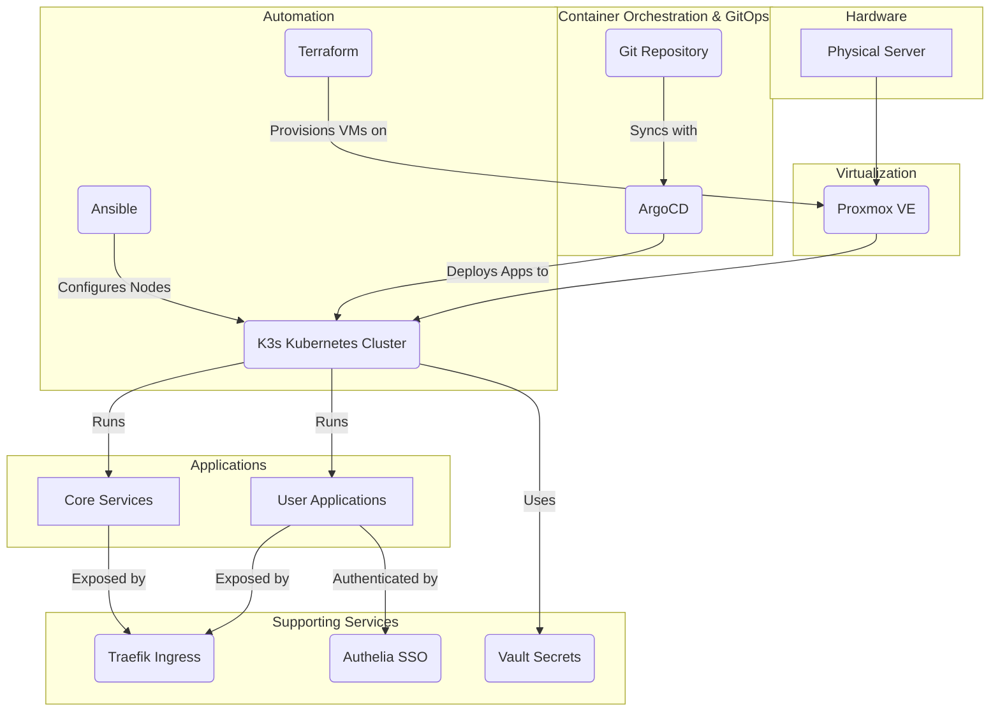
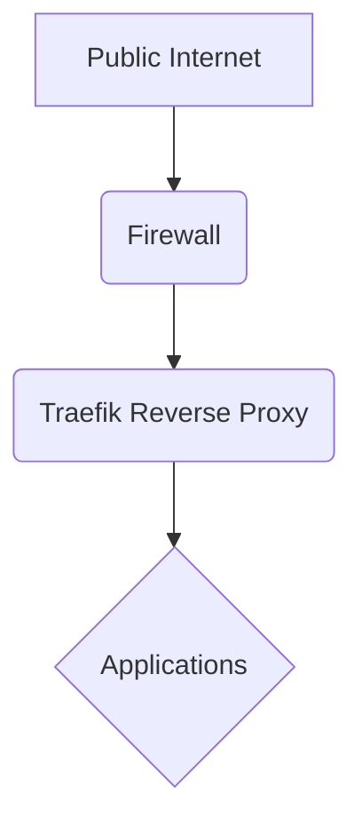
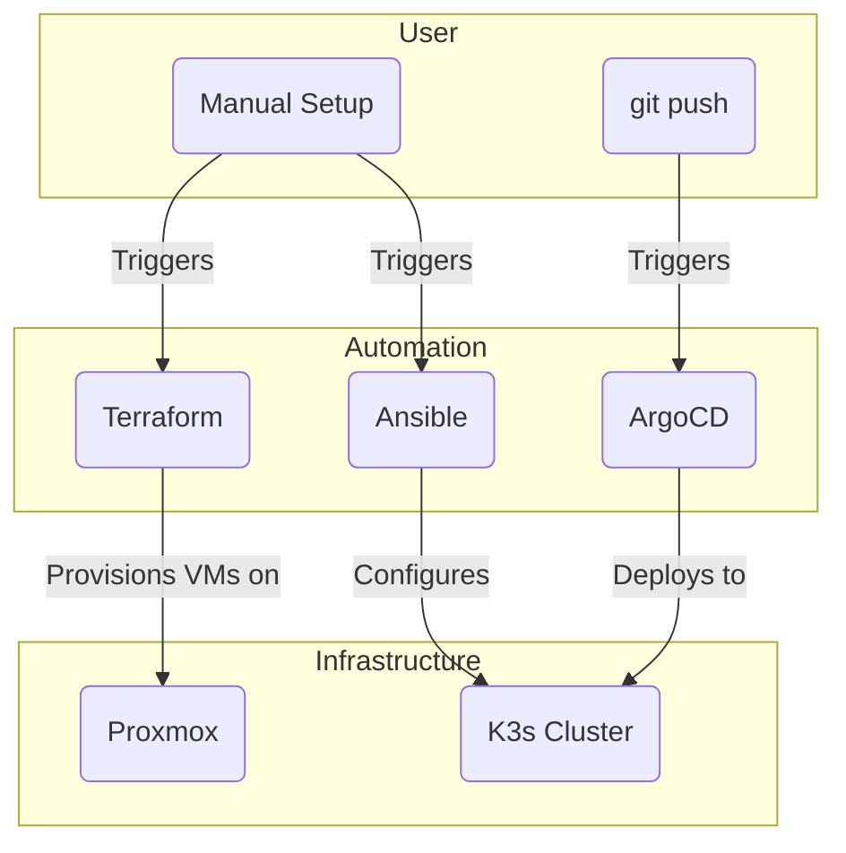

# Homelab as Code

This project automates the setup of a homelab environment on a Proxmox server using a combination of Terraform, Ansible, and ArgoCD. It provisions a K3s cluster, configures the nodes, and deploys a suite of applications using a GitOps approach.

The project is designed to be idempotent and modular, allowing you to easily customize your homelab by adding or removing applications to fit your needs.

## Table of Contents

- [Homelab as Code](#homelab-as-code)
  - [Prerequisites](#prerequisites)
  - [Getting Started](#getting-started)
  - [System Architecture](#system-architecture)
    - [Core Components](#core-components)
    - [Architecture Diagram](#architecture-diagram)
  - [Default Services](#default-services)
    - [Core Infrastructure](#core-infrastructure)
    - [Applications](#applications)
  - [Deployment Workflow](#deployment-workflow)
  - [Configuration](#configuration)
    - [Terraform](#terraform)
    - [Terraform Commands](#terraform-commands)
    - [Ansible](#ansible)
  - [Usage](#usage)
  - [Testing](#testing)
  - [Homelab Importer](#homelab-importer)
  - [OpenLDAP](#openldap)
    - [Configuration](#configuration-1)
  - [Post-Installation](#post-installation)
  - [Stealth VM](#stealth-vm)
    - [Prerequisites](#prerequisites-1)
    - [Usage](#usage-1)
    - [Disclaimer](#disclaimer)
  - [Troubleshooting](#troubleshooting)
    - [Terraform Fails to Apply Changes](#terraform-fails-to-apply-changes)
    - [Ansible Playbook Fails to Run](#ansible-playbook-fails-to-run)
    - [Application Is Not Accessible](#application-is-not-accessible)
    - [Restarting the Setup Process](#restarting-the-setup-process)
  - [Customization](#customization)
    - [Adding New Applications](#adding-new-applications)
    - [Managing Secrets](#managing-secrets)
    - [Configuring Network Settings](#configuring-network-settings)
    - [Using Different Cloud-Init Templates](#using-different-cloud-init-templates)
  - [Contributing](#contributing)
  - [GitHub Actions](#github-actions)
    - [Promote to Staging](#promote-to-staging)

## Prerequisites

Before you begin, you will need the following:

-   A **Proxmox server** with a cloud-init template for your desired operating system.
-   **Terraform** and **Ansible** installed on your local machine.
-   **[yq](https://github.com/mikefarah/yq#install)** for processing YAML files.
-   **[kubectl](https://kubernetes.io/docs/tasks/tools/install-kubectl/)** to interact with the Kubernetes cluster.
-   **[argocd](https://argo-cd.readthedocs.io/en/stable/cli_installation/)** CLI (optional) for managing ArgoCD from the command line.
-   An **API token** for your Proxmox server.
-   A **password manager** such as Bitwarden or 1Password to store your secrets.

## Getting Started

These instructions will guide you through setting up the homelab environment on your Proxmox server. The automated `make setup` command is currently not recommended as it follows an outdated workflow. Please follow the manual steps below for a successful deployment.

### 1. Clone the Repository

```bash
git clone https://github.com/toxicoder/homelabeazy.git
cd homelabeazy
```

### 2. Configure Your Environment

1.  **Copy the example configuration:**
    ```bash
    cp -r config.example/ config/
    ```
2.  **Edit `config/config.yml`:**
    - This file is the central place for all your configuration. Review the variables and adjust them to your needs.
3.  **Create `terraform.tfvars`:**
    - Copy the example file:
      ```bash
      cp infrastructure/proxmox/terraform.tfvars.example infrastructure/proxmox/terraform.tfvars
      ```
    - Edit `infrastructure/proxmox/terraform.tfvars` with your Proxmox API credentials.

### 3. Provision the Infrastructure

Run the following command to provision the virtual machines for the K3s cluster on Proxmox:

```bash
make terraform-apply
```

### 4. Configure the Cluster with Ansible

1.  **Create the Ansible Inventory:**
    - After `terraform apply` is complete, you need to get the IP addresses of the newly created VMs from the Proxmox console.
    - Create a file named `ansible/inventory/inventory.auto.yml` and add the IP addresses in the following format:
      ```yaml
      # ansible/inventory/inventory.auto.yml
      all:
        hosts:
          k3s-master:
            ansible_host: <IP_of_master_node>
          k3s-worker-0:
            ansible_host: <IP_of_worker_node_0>
          # Add more workers if you have them
      ```
2.  **Run the Ansible Playbook:**
    - This will configure the nodes, install K3s, and set up some core components.
    ```bash
    make ansible-playbook-setup
    ```

### 5. Deploy Applications with ArgoCD

This project uses a GitOps approach with ArgoCD to manage applications.

1.  **Install ArgoCD:**
    - If you don't have ArgoCD running on your cluster, you need to install it. You can follow the [official ArgoCD documentation](https://argo-cd.readthedocs.io/en/stable/getting_started/).
2.  **Deploy the App of Apps:**
    - The `apps/app-of-apps.yml` manifest is the entry point for all applications in this repository. Applying this manifest to your cluster will have ArgoCD automatically deploy and manage all the other applications defined in the `apps/` directory.
    - You can apply it using `kubectl`:
      ```bash
      kubectl apply -f apps/app-of-apps.yml
      ```
    - Alternatively, you can create the application using the ArgoCD UI or CLI, pointing it to this Git repository and the `apps/` path.

### 6. Manage Secrets

This project uses HashiCorp Vault to manage secrets. The `ansible/roles/vault-secrets-operator` role is responsible for deploying the [HashiCorp Vault Secrets Operator](https://www.vaultproject.io/docs/platform/k8s/vso), which in turn is responsible for reading the application configurations, fetching secrets from Vault, and creating the necessary Kubernetes secrets.

**How it Works:**

1.  **Configuration:** The configuration for each application is defined in a `values.yaml` file located in the `config/apps/<app-name>` directory.
2.  **Secret Declaration:** Within these `values.yaml` files, secrets are declared using the following format:
    ` yaml some_secret: "vault:secret/data/path/to/secret#key"  `
      * `vault:`: This prefix indicates that the value is a secret to be fetched from Vault.
      * `secret/data/path/to/secret`: This is the path to the secret in Vault's KVv2 secrets engine.
      * `key`: This is the key of the secret to retrieve.
3.  **Ansible Role:** The `ansible/roles/vault-secrets-operator` Ansible role performs the following actions:
      * Deploys the [HashiCorp Vault Secrets Operator](https://www.vaultproject.io/docs/platform/k8s/vso) to the Kubernetes cluster.

**Example:**

Let's say you have the following configuration in `config/apps/gitea/values.yaml`:

```yaml
gitea:
  admin:
    existingSecret: "vault:secret/data/gitea#admin_creds"
```

The `vault-secrets-operator` will:

1.  Identify that `gitea.admin.existingSecret` is a Vault secret.
2.  Fetch the value of the `admin_creds` key from the `secret/data/gitea` path in Vault.
3.  Create a Kubernetes secret named `gitea-secrets` with the fetched value.

**Adding New Secrets:**

To add a new secret, you need to:

1.  Add the secret to Vault at the desired path.
2.  Update the corresponding `values.yaml` file to reference the new secret using the `vault:` prefix.
3.  Commit and push your changes to the Git repository. ArgoCD will automatically apply the changes.

### Private Gitea Setup

This repository is designed to be used as a template. You can clone it from GitHub, and then push it to your own private Gitea instance to store your homelab's configuration securely.

**Follow these steps to set up your private repository:**

1.  **Clone the repository from GitHub:**

    ```bash
    git clone https://github.com/toxicoder/homelabeazy.git
    cd homelabeazy
    ```

2.  **Copy and customize the example configurations:**
    This repository comes with example configuration files. You'll need to copy them and customize them for your own environment.

      - `config.example/`: This directory contains example application configurations. You should create a `config/` directory and copy the contents of `config.example/` into it. The `config/` directory is ignored by git, so you can store your private configurations there.
        ```bash
        cp -r config.example/ config/
        ```
      - `ansible/group_vars/all.yml`: This file contains global variables for Ansible. You can edit this file to customize your deployment.
      - `ldap.toml`: This is the configuration file for LDAP. Copy `ldap.toml.example` to `ldap.toml` and edit it.
        ```bash
        cp ldap.toml.example ldap.toml
        ```
      - `infrastructure/proxmox/terraform.tfvars`: This file contains the variables for Terraform. Copy `infrastructure/proxmox/terraform.tfvars.example` to `infrastructure/proxmox/terraform.tfvars` and edit it.
        ```bash
        cp infrastructure/proxmox/terraform.tfvars.example infrastructure/proxmox/terraform.tfvars
        ```

3.  **Set up your private Gitea repository:**

      - Create a new private repository in your Gitea instance.
      - Add your Gitea repository as a new remote:
        ```bash
        git remote set-url origin <your-gitea-repo-url>
        ```
      - Push the code to your Gitea repository:
        ```bash
        git push -u origin main
        ```

### Application Configuration

The configuration for each application is defined in a `values.yaml` file located in the `config/apps/<app-name>` directory. These files are standard Helm values files, so you can use any valid Helm syntax. You can also use variables from the `config/config.yml` file in these `values.yaml` files.

**Customizing Application Configuration:**

To customize the configuration of an application, you can edit its `values.yaml` file. For example, to change the number of replicas for Gitea, you would edit `config/apps/gitea/values.yaml` and modify the `replicaCount` value.

After making your changes, commit and push them to your Git repository. ArgoCD will automatically detect the changes and apply them to the cluster.

## System Architecture

This homelab is built on a foundation of Proxmox for virtualization, with Terraform and Ansible for infrastructure provisioning and node configuration. Applications are managed using a GitOps workflow with ArgoCD. The core of the homelab is a K3s cluster, which is a lightweight, certified Kubernetes distribution.

### Core Components

  - **Proxmox:** A powerful open-source virtualization platform that provides the foundation for the homelab.
  - **Terraform:** Used to provision the virtual machines for the K3s cluster on Proxmox.
  - **Ansible:** Used for configuration management of the K3s nodes.
  - **ArgoCD:** A declarative, GitOps continuous delivery tool for Kubernetes. It is used to deploy and manage applications.
  - **K3s:** A lightweight, certified Kubernetes distribution that is easy to install and manage.
  - **Traefik:** A modern reverse proxy and load balancer that makes deploying microservices easy.
  - **Authelia:** An open-source authentication and authorization server providing two-factor authentication and single sign-on.
  - **OpenLDAP:** A lightweight directory access protocol for user authentication.
  - **Vault:** A tool for securely accessing secrets.
  - **Velero:** A tool for backing up and restoring your Kubernetes cluster resources and persistent volumes.
  - **EFK Stack:** A centralized logging solution consisting of Elasticsearch, Fluentd, and Kibana.

### Networking

This homelab uses a VLAN-based network segmentation strategy to isolate different types of traffic. This is a fundamental security best practice that helps to prevent lateral movement in the event of a security breach.

The following VLANs are defined:

  * **VLAN 10 (Service Network):** This network is used for the services running in the homelab, such as the K3s cluster and other applications.
  * **VLAN 20 (Guest Network):** This network is used for guest devices and is isolated from the rest of the network.
  * **VLAN 30 (Management Network):** This network is used for managing the Proxmox host and other infrastructure components.

Service discovery is provided by Consul. All services are automatically registered with Consul, which allows them to discover each other and communicate securely.

Firewall rules are managed by pfSense. The firewall is configured to allow traffic between the VLANs according to a set of predefined rules.

For more detailed information about the networking setup, please see the [networking documentation](infrastructure/proxmox/networking/README.md).

### System Architecture Diagram



### System Architecture Walkthrough

The system architecture is designed to be a robust, scalable, and automated homelab environment. Here’s a step-by-step walkthrough of the diagram, explaining the role and value of each component:

1.  **Hardware (Physical Server):**

      - **Component:** `Physical Server`
      - **Role:** This is the foundation of the entire homelab, providing the necessary compute, memory, and storage resources.
      - **Value:** A dedicated physical server ensures that all virtualized components have direct access to high-performance hardware, leading to better overall performance and stability.

2.  **Virtualization (Proxmox VE):**

      - **Component:** `Proxmox VE`
      - **Role:** Proxmox is an open-source virtualization platform that runs on the physical server. It allows for the creation and management of virtual machines (VMs) and containers.
      - **Value:** Proxmox enables efficient hardware utilization by allowing multiple isolated environments to run on a single physical machine. This is crucial for creating a flexible and scalable infrastructure.

3.  **Automation (Terraform & Ansible):**

      - **Component:** `Terraform` & `Ansible`
      - **Role:**
          - `Terraform` is used to provision the virtual machines on Proxmox. It defines the infrastructure as code, making it easy to create, modify, and destroy VMs in a repeatable manner.
          - `Ansible` is used for configuration management. Once the VMs are provisioned, Ansible configures them and installs the necessary software like K3s.
      - **Value:** This combination of tools automates the entire setup process, reducing manual effort and ensuring consistency. It allows you to rebuild the entire homelab from scratch with minimal intervention.

4.  **Container Orchestration & GitOps (K3s & ArgoCD):**

      - **Component:** `K3s Kubernetes Cluster` & `ArgoCD`
      - **Role:**
          - `K3s` is a lightweight, certified Kubernetes distribution that runs on the VMs. It orchestrates the deployment, scaling, and management of containerized applications.
          - `ArgoCD` provides a GitOps workflow. It continuously monitors a Git repository and automatically deploys any changes to the K3s cluster, ensuring that the cluster state always matches the state defined in Git.
      - **Value:** Kubernetes provides a powerful and standardized platform for running applications. ArgoCD automates application deployment and management, making it easy to track changes, roll back to previous versions, and maintain a consistent environment.

5.  **Applications (Core Services & User Applications):**

      - **Component:** `Core Services` & `User Applications`
      - **Role:** The K3s cluster runs two types of applications:
          - `Core Services`: These are essential infrastructure components like monitoring, logging, and security services.
          - `User Applications`: These are the end-user applications that you want to run in your homelab, such as a password manager, Git service, or home automation platform.
      - **Value:** This separation allows you to manage the core infrastructure independently of the applications, making it easier to update and maintain both.

6.  **Supporting Services (Traefik, Authelia, Vault):**

      - **Component:** `Traefik Ingress`, `Authelia SSO`, `Vault Secrets`
      - **Role:**
          - `Traefik Ingress`: A reverse proxy and load balancer that manages external access to the applications running in the cluster.
          - `Authelia SSO`: Provides single sign-on and two-factor authentication for the applications, enhancing security.
          - `Vault Secrets`: A secure storage for secrets like API keys, passwords, and certificates.
      - **Value:** These services provide essential functionality for managing and securing the applications. Traefik simplifies routing, Authelia centralizes authentication, and Vault protects sensitive information.

### General Flow of the System

1.  **Provisioning:** `Terraform` provisions the virtual machines on `Proxmox`.
2.  **Configuration:** `Ansible` configures the VMs and installs the `K3s Kubernetes Cluster`.
3.  **Deployment:** `ArgoCD` monitors the Git repository and deploys the `Core Services` and `User Applications` to the `K3s` cluster.
4.  **Access:**
      - Users access the applications through the `Traefik Ingress`.
      - `Authelia SSO` intercepts the requests to handle authentication.
5.  **Secrets Management:** The applications and the cluster use `Vault` to securely retrieve their secrets.

### Network Architecture



### Code Execution Flow



## Default Services

The following services are included in this homelab. Some are core infrastructure components, while others are applications that can be deployed.

### Core Infrastructure

| Service           | Description                                                                                             |
| ----------------- | ------------------------------------------------------------------------------------------------------- |
| **Traefik** | A modern reverse proxy and load balancer that makes deploying microservices easy.                       |
| **Authelia** | An open-source authentication and authorization server providing two-factor authentication and single sign-on. |
| **OpenLDAP** | A lightweight directory access protocol for user authentication.                                        |
| **Vault** | A tool for securely accessing secrets.                                                                  |
| **Velero** | A tool for backing up and restoring your Kubernetes cluster resources and persistent volumes.           |
| **EFK Stack** | A centralized logging solution consisting of Elasticsearch, Fluentd, and Kibana.                      |

### Applications

| Service           | Description                                                                                             |
| ----------------- | ------------------------------------------------------------------------------------------------------- |
| **AppFlowy**      | An open-source alternative to Notion.                                                                   |
| **Authelia**      | An open-source authentication and authorization server.                                                 |
| **Bitwarden**     | A self-hosted password manager.                                                                         |
| **Bolt**          | A content management system.                                                                            |
| **Coder**         | A remote development environment that runs on your own infrastructure.                                  |
| **Docling**       | A documentation site generator.                                                                         |
| **Gitea**         | A self-hosted Git service.                                                                              |
| **Gluetun**       | A VPN client in a container to secure other services.                                                   |
| **Grafana**       | A monitoring and observability platform.                                                                |
| **Guacamole**     | A clientless remote desktop gateway.                                                                    |
| **Home Assistant**| An open-source home automation platform.                                                                |
| **Homebox**       | A simple, a static homepage for your homelab.                                                             |
| **Homelab Importer**| A tool for importing homelab configurations.                                                          |
| **Jackett**       | A proxy server for torrent trackers.                                                                    |
| **Jellyfin**      | A self-hosted media server.                                                                             |
| **Jellyseerr**    | A request management and media discovery tool for Jellyfin.                                             |
| **Kasm**          | A container streaming platform for running desktops and applications in a browser.                      |
| **Kiwix**         | An offline reader for online content like Wikipedia.                                                    |
| **Langflow**      | A UI for experimenting with and prototyping language models.                                            |
| **Lidarr**        | A music collection manager for Usenet and BitTorrent users.                                             |
| **Linkwarden**    | A self-hosted, open-source collaborative bookmark manager.                                              |
| **MariaDB**       | A popular open-source relational database.                                                              |
| **Meilisearch**   | A fast, open-source, and powerful search engine.                                                        |
| **Metube**        | A web UI for youtube-dl.                                                                                |
| **Monitoring**    | A full monitoring stack including Prometheus, Grafana, and Alertmanager.                                |
| **Open WebUI**    | A user-friendly web interface for large language models.                                                |
| **OpenEDAI Speech**| A text-to-speech application.                                                                         |
| **OpenLDAP**      | A lightweight directory access protocol for user authentication.                                        |
| **Overseerr**     | A request management and media discovery tool for Plex.                                                 |
| **Perplexica**    | An open-source AI search engine.                                                                        |
| **pfSense**       | A powerful open-source firewall and router.                                                             |
| **Pi-hole**       | A network-wide ad blocker.                                                                              |
| **Plex**          | A self-hosted media server.                                                                             |
| **Portainer**     | A lightweight management UI for Docker, Swarm, Kubernetes, and ACI.                                     |
| **Postgres**      | A powerful, open-source object-relational database system.                                              |
| **Puter**         | A self-hosted cloud desktop.                                                                            |
| **qBittorrent**   | A lightweight BitTorrent client.                                                                        |
| **Radarr**        | A movie collection manager for Usenet and BitTorrent users.                                             |
| **Redis**         | An in-memory data structure store.                                                                      |
| **Sabnzbd**       | A binary newsreader for downloading from Usenet.                                                        |
| **SearXNG**       | A privacy-respecting, hackable metasearch engine.                                                       |
| **Sonarr**        | A PVR for Usenet and BitTorrent users.                                                                  |
| **Supabase**      | An open-source Firebase alternative.                                                                    |
| **Tailscale**     | A zero-config VPN for building secure networks.                                                         |
| **Tika**          | A content analysis toolkit.                                                                             |
| **Traefik**       | A modern reverse proxy and load balancer.                                                               |
| **WireGuard**     | A fast, modern, and secure VPN tunnel.                                                                  |

## Deployment

This project uses Terraform workspaces to manage multiple environments. Each workspace represents a different environment (e.g., `dev`, `staging`, `prod`). The current workspace is determined by the `TF_WORKSPACE` environment variable.

### Environments

  * **dev:** The development environment. This is the default workspace. It is used for testing new features and changes.
  * **staging:** The staging environment. This workspace is used for testing changes before they are deployed to production.
  - **prod:** The production environment. This workspace is used for the live application.

### Managing Environments

You can switch between workspaces using the `terraform workspace select` command.

```bash
terraform workspace select <workspace-name>
```

For example, to switch to the `staging` workspace, you would run the following command:

```bash
terraform workspace select staging
```

### Promoting to Staging

To promote the current version of the `main` branch to the staging environment, you can manually trigger the `Promote to Staging` workflow.

1.  Go to the "Actions" tab of the repository.
2.  Select the "Promote to Staging" workflow.
3.  Click the "Run workflow" button.

### Promoting to Production

To promote the current version of the `staging` branch to the production environment, you can manually trigger the `Promote to Production` workflow. This workflow will merge the `staging` branch into the `main` branch and then deploy the changes to the production environment.

1.  Go to the "Actions" tab of the repository.
2.  Select the "Promote to Production" workflow.
3.  Click the "Run workflow" button.

## Deployment Workflow

This project follows a GitOps methodology for application deployment, with infrastructure managed as code. The workflow is as follows:

1.  **Provision Infrastructure:** Use Terraform to create the virtual machines for the K3s cluster on Proxmox. This is typically a one-time setup or for making infrastructure-level changes.

2.  **Configure Cluster:** Use Ansible to configure the K3s nodes, install necessary packages, and set up core components. This is also a one-time setup or for node-level configuration changes.

3.  **Deploy and Manage Applications:** Applications are managed by ArgoCD. To deploy, update, or remove an application, you make changes to the corresponding YAML files in the `apps/` directory and push them to the Git repository. ArgoCD automatically syncs these changes to the cluster.

## Configuration

Configuration for this project is managed in several places:

1.  **Global Settings:** The `config/config.yml` file contains high-level settings for your homelab.
2.  **Terraform Variables:** The `infrastructure/proxmox/terraform.tfvars` file contains variables specific to the Proxmox infrastructure.
3.  **Ansible Inventory:** The Ansible inventory file tells Ansible which hosts to connect to.
4.  **Application Configuration:** The `config/apps/` directory contains `values.yaml` files for each application, which are used to configure the Helm charts deployed by ArgoCD.

### 1. Global Configuration (`config/config.yml`)

This file is the central place for all your high-level configuration. It is created when you run `make setup` by copying the example file from `config.example/config.yml`.

| Variable                   | Description                                                 |
| -------------------------- | ----------------------------------------------------------- |
| `common.domain_name`       | The domain name for your homelab (e.g., `homelab.local`).   |
| `common.timezone`          | The timezone for the servers (e.g., `Etc/UTC`).             |
| `common.load_balancer_ip`  | The IP address to be used by the Kubernetes load balancer.  |
| `common.proxmox_node`      | The name of the Proxmox node to deploy to.                  |
| `common.proxmox_template`  | The name of the cloud-init template to use for new VMs.     |
| `common.proxmox_service_bridge` | The Proxmox network bridge for the service network.    |
| `common.proxmox_service_vlan_tag` | The VLAN tag for the service network.               |
| `common.k3s_master_vm_id`  | The VM ID for the K3s master node.                          |
| `common.k3s_worker_vm_id_start` | The starting VM ID for the K3s worker nodes.            |
| `common.ldap_base_dn`      | The base DN for the LDAP server.                            |
| `secrets_to_generate`      | A list of secrets to be generated by the `secure-gen` role. |

### 2. Terraform Variables (`terraform.tfvars`)

This file holds the variables needed by Terraform to provision the infrastructure on Proxmox. The `make setup` command will prompt you for the required API credentials.

| Variable              | Description                                                                 |
| --------------------- | --------------------------------------------------------------------------- |
| `proxmox_api_url`     | The URL of your Proxmox API (e.g., `https://proxmox.example.com/api2/json`). |
| `pm_token_id`         | Your Proxmox API token ID.                                                  |
| `pm_token_secret`     | Your Proxmox API token secret.                                              |
| `proxmox_node`        | The name of the Proxmox node to deploy to.                                  |
| `proxmox_template`    | The name of the cloud-init template to use for the VMs.                     |
| `k3s_worker_count`    | The number of K3s worker nodes to create. Defaults to `1`.                  |
| `k3s_master_memory`   | The amount of memory (in MB) for the master VM. Defaults to `2048`.         |
| `k3s_master_cores`    | The number of CPU cores for the master VM. Defaults to `2`.                 |
| `k3s_worker_memory`   | The amount of memory (in MB) for the worker VMs. Defaults to `2048`.         |
| `k3s_worker_cores`    | The number of CPU cores for the worker VMs. Defaults to `22`.               |

### 3. Ansible Inventory

> ⚠️ **Important:** The automatic generation of the Ansible inventory file is currently **not implemented**.
>
> The Terraform configuration **does not** create this file. This means that after running `make terraform-apply`, the subsequent Ansible playbook will fail.
>
> **Workaround:**
>
> To make the Ansible playbook run, you must manually create the `ansible/inventory/inventory.auto.yml` file after your infrastructure is provisioned. You will need to get the IP addresses of the VMs created by Terraform from the Proxmox console.
>
> The file should look something like this:
>
> ```yaml
> # ansible/inventory/inventory.auto.yml
> all:
>   hosts:
>     k3s-master:
>       ansible_host: 192.168.1.10
>     k3s-worker-0:
>       ansible_host: 192.168.1.11
> ```

## Usage

This project includes a `Makefile` that provides a convenient way to run common tasks.

### Makefile Commands

  - **`make help`**: Display a list of available commands.
  - **`make install-deps`**: Install dependencies.
  - **`make setup`**: Run the interactive setup script for the homelab. **(Not Recommended)**
  - **`make lint`**: Run all linters.
  - **`make terraform-init`**: Initialize Terraform.
  - **`make terraform-plan`**: Plan the Terraform deployment.
  - **`make terraform-apply`**: Apply the Terraform deployment.
  - **`make ansible-playbook-setup`**: Run the main Ansible playbook for setup.
  - **`make test`**: Run Molecule tests for all Ansible roles.
  - **`make clean`**: Clean up temporary files.

## Testing

Some parts of this project have tests, but the overall testing framework is still under development. You can run the available tests with:

```bash
make test
```

## Homelab Importer

This repository includes a tool to import an existing, manually-configured Proxmox environment into a Terraform-managed setup. This is useful for migrating your existing homelab to this project's infrastructure as code approach.

For detailed instructions on how to use the importer, please see the [Homelab Importer README](tools/homelab-importer/README.md).

## OpenLDAP

This repository includes an Ansible role for deploying OpenLDAP to the Kubernetes cluster. The role can be found in `ansible/roles/openldap`.

### Configuration

The OpenLDAP role uses the following variables for configuration:

  - `openldap_root_password`: The password for the OpenLDAP root user.
  - `openldap_admin_password`: The password for the OpenLDAP admin user.

These variables should be set as environment variables before running the Ansible playbook:

```bash
export OPENLDAP_ROOT_PASSWORD="your-root-password"
export OPENLDAP_ADMIN_PASSWORD="your-admin-password"
```

The OpenLDAP application is deployed using the `apps/openldap.yml` manifest. The passwords for the OpenLDAP users are managed by Vault. You will need to add the following secrets to Vault:

  - `secrets/data/openldap`
      - `root-password`
      - `admin-password`

## Post-Installation

After the setup is complete, you will need to perform the following steps to access your new homelab environment:

### 1\. Access Proxmox

You can access the Proxmox web interface by navigating to the IP address of your Proxmox server in your web browser.

### 2\. Access the Kubernetes Cluster

The K3s cluster is now running on your Proxmox server. You can access it by SSHing into one of the master nodes and using the `kubectl` command-line tool. The kubeconfig file is located at `~/.kube/config` on the master node.

### 3\. Configure DNS

You will need to configure DNS for your applications to be accessible at their respective domain names. This can be done by adding DNS records to your DNS provider or by using a local DNS server such as Pi-hole.

**Example: Using Pi-hole for Local DNS**

1.  Log in to your Pi-hole admin interface.
2.  Navigate to "Local DNS" -\> "DNS Records".
3.  Add a new A record for your domain, pointing to the IP address of your Traefik load balancer. For example:

| Domain      | IP Address      |
| ----------- | --------------- |
| `*.example.com` | `192.168.1.100` |

This will resolve all subdomains of `example.com` to the IP address of your Traefik load balancer.

### 4\. Access Applications

Once DNS is configured, you can access the applications by navigating to their respective domain names in your web browser.

**Example: Accessing Grafana**

1.  Open your web browser and navigate to `https://grafana.example.com`.
2.  You will be redirected to the Authelia login page.
3.  Log in with your credentials.
4.  You will then be redirected to the Grafana dashboard.

## Stealth VM

This project includes an optional "stealth" Windows VM on Proxmox. The purpose of this VM is to allow for game streaming from a server. It aims to provide a normal gaming environment, which can sometimes be challenging on virtualized hardware.

### Our Stance on Cheating

**This project is firmly against cheating in any form.** The "stealth" features are designed to make the virtual machine appear as a standard physical machine to the game, ensuring compatibility and performance. It is **not** intended to enable or facilitate cheating. We believe in fair play and sportsmanship. Any use of this project for activities that violate the terms of service of a game, including cheating, is strictly discouraged.

### Prerequisites

  - Proxmox 8.x+
  - A Windows ISO file
  - The PCI ID of the GPU you want to pass through
  - The MAC address of your physical network card

### Usage

To enable the stealth VM, run the `scripts/setup.sh` script and answer "y" when prompted to enable the stealth VM. You will then be prompted for the Windows ISO path, GPU PCI ID, and real MAC address.

### Disclaimer

This feature is intended for running games on a virtual machine for streaming purposes. Using this for any form of cheating is against the principles of this project. The author of this project is not responsible for any consequences that may arise from the misuse of this feature.

## Troubleshooting

This section provides solutions to common problems you may encounter during the setup process.

### `scripts/setup.sh` Script Fails

If the `scripts/setup.sh` script fails, it is most likely due to an issue with the Terraform or Ansible commands that it is running. To debug the issue, you can run the commands manually and inspect the output.

1.  **Run Terraform manually:**
    ```bash
    cd terraform
    terraform init
    terraform plan
    terraform apply
    ```
2.  **Run Ansible manually:**
    ```bash
    cd ansible
    ansible-playbook -i inventory/inventory.auto.yml playbooks/main.yml
    ```

### Terraform Fails to Apply Changes

If Terraform fails to apply the changes, it may be due to a problem with your Proxmox environment. Check the following:

  - **Proxmox API Token:** Make sure your Proxmox API token has the correct permissions.
  - **Proxmox Host:** Make sure the Proxmox host is running and accessible.
  - **Cloud-init Template:** Make sure the cloud-init template exists and is configured correctly.

### Ansible Playbook Fails to Run

If the Ansible playbook fails to run, it may be due to a problem with your SSH connection. Check the following:

  - **SSH Key:** Make sure your SSH key is added to your SSH agent.
  - **SSH Connection:** Make sure you can connect to the nodes using SSH.

### Application Is Not Accessible

If an application is not accessible, it may be due to a problem with the Traefik Ingress controller or the application itself.

  - **Check the Traefik Dashboard:** The Traefik dashboard will show you the status of your Ingress routes and whether there are any errors.
  - **Check the Application Logs:** Use `kubectl logs` to check the logs of the application's pods. This will often give you a clue as to what is wrong.
    ```bash
    kubectl logs -l app=<app-name>
    ```
  - **Check the Ingress Route:** Make sure the Ingress route for the application is configured correctly.
    ```bash
    kubectl get ingressroute -n <namespace>
    ```
  - **Check DNS:** Make sure the DNS record for the application is pointing to the correct IP address.

### Restarting the Setup Process

If you encounter an issue that you cannot resolve, you can restart the setup process from the beginning.

1.  **Destroy the infrastructure:**

    ```bash
    make destroy
    ```

2.  **Delete the `terraform.tfvars` file:**

    ```bash
    rm infrastructure/proxmox/terraform.tfvars
    ```

3.  **Delete the `ansible/inventory/inventory.auto.yml` file:**

    ```bash
    rm ansible/inventory/inventory.auto.yml
    ```

4.  **Run the setup process again by following the steps in the "Getting Started" section.**

## Customization

This project is highly customizable. You can add new applications, manage secrets, and configure network settings to fit your needs.

### Adding New Applications

To add a new application, you need to add a new ArgoCD application manifest to the `apps/` directory. This typically involves the following steps:

1.  **Find or create a Helm chart for the application.**
2.  **Create a new `values.yaml` file** in `config/apps/<app-name>/` to store the configuration for the application.
3.  **Create a new YAML file** in the `apps/` directory (e.g., `apps/<app-name>.yml`). This file will define an ArgoCD `Application` resource that points to the Helm chart and your `values.yaml` file.
4.  **Add the new application to `apps/app-of-apps.yml`** so that it is automatically deployed with the other applications.
5.  **Commit and push your changes** to the Git repository. ArgoCD will automatically deploy the new application.

### Managing Secrets

This project uses Vault to manage secrets by default. The `secure-gen` script will automatically generate any secrets defined in the `secrets_to_generate` section of your `config/config.yml` file and store them in Vault.

### Configuring Network Settings

All network settings can be configured in the `config/config.yml` file.

### Using Different Cloud-Init Templates

This project uses a cloud-init template to configure the virtual machines. You can use a different cloud-init template by modifying the `template_name` variable in the `terraform/terraform.tfvars` file.

## Contributing

Contributions are welcome\! If you would like to contribute to this project, please follow these steps:

1.  **Open an issue:** Before you start working on a new feature or bug fix, please open an issue to discuss it with the project maintainers. This will help to ensure that your contribution is in line with the project's goals.
2.  **Fork the repository:** Fork the repository to your own GitHub account.
3.  **Create a new branch:** Create a new branch for your changes.
4.  **Make your changes:** Make your changes and commit them with a clear and concise commit message.
5.  **Push your changes:** Push your changes to your fork.
6.  **Create a pull request:** Create a pull request to merge your changes into the `main` branch.

## GitHub Actions

This project uses GitHub Actions to automate the CI/CD process.

### Promote to Staging

To promote the current version of the `main` branch to the staging environment, you can manually trigger the `Promote to Staging` workflow.

1.  Go to the "Actions" tab of the repository.
2.  Select the "Promote to Staging" workflow.
3.  Click the "Run workflow" button.

## License

This project is licensed under the MIT License. See the [LICENSE](LICENSE) file for details.
