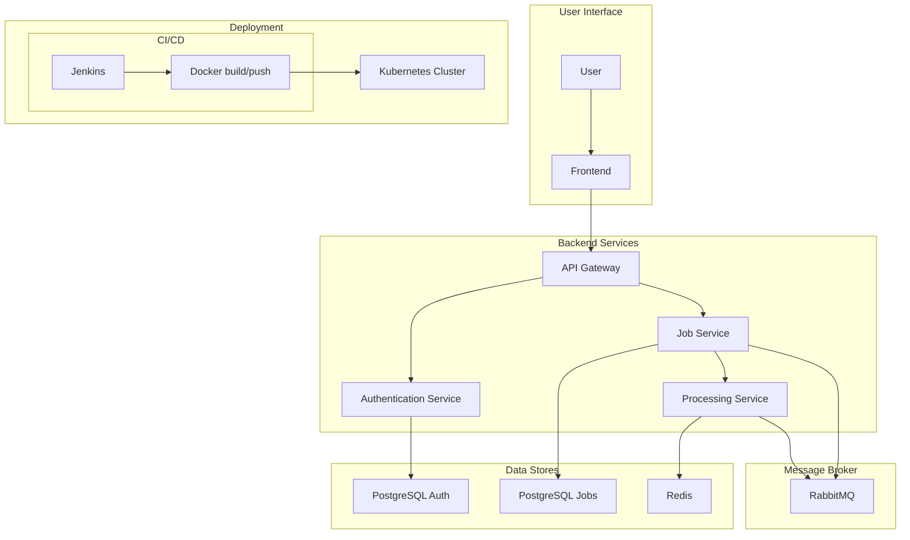

# Homelab as Code

This project uses Ansible to automate the setup of a homelab environment on a Proxmox server. It will provision a K3s cluster and deploy a set of core infrastructure and applications.

## Getting Started

There are two ways to get started with this project:

- **One-Click Setup:** This is the easiest way to get started. It will automatically provision the infrastructure and deploy the applications.
- **Manual Setup:** This is for advanced users who want to customize the installation.

### One-Click Setup

1.  **Clone the repository:**

    ```bash
    git clone https://github.com/your-username/homelab-as-code.git
    cd homelab-as-code
    ```

2.  **Run the setup script:**

    ```bash
    ./setup.sh
    ```

    This script will:

    - Ask you for your Proxmox API URL, API token, and other details.
    - Create a `terraform.tfvars` file with the information you provided.
    - Run `terraform init`, `terraform plan`, and `terraform apply` to provision the infrastructure.
    - Create an `ansible/group_vars/all.yml` file with the information you provided.
    - Run the Ansible playbook to deploy the applications.

### Manual Setup

If you want to customize the installation, you can follow these steps:

1.  **Clone the repository:**

    ```bash
    git clone https://github.com/your-username/homelab-as-code.git
    cd homelab-as-code
    ```

2.  **Configure Terraform:**

    - Navigate to the `terraform` directory.
    - Create a `terraform.tfvars` file by copying the example:
      ```bash
      cp terraform.tfvars.example terraform.tfvars
      ```
    - Edit `terraform.tfvars` to match your environment.

3.  **Provision the infrastructure:**

    - Initialize Terraform:
      ```bash
      terraform init
      ```
    - Plan the deployment:
      ```bash
      terraform plan
      ```
    - Apply the changes:
      ```bash
      terraform apply
      ```

4.  **Configure Ansible:**

    - Edit `ansible/group_vars/all.yml` to set your domain name, user passwords, and other application-specific configurations.

5.  **Run the Ansible playbook:**

    ```bash
    ansible-playbook -i ansible/inventory/inventory.auto.yml ansible/playbooks/setup.yml
    ```

## System Architecture

This homelab is built on a foundation of Proxmox for virtualization, with Terraform and Ansible for infrastructure as code. The core of the homelab is a K3s cluster, which is a lightweight, certified Kubernetes distribution.

### Core Components

- **Proxmox:** A powerful open-source virtualization platform that provides the foundation for the homelab.
- **Terraform:** Used to provision the virtual machines for the K3s cluster on Proxmox.
- **Ansible:** Used for configuration management and application deployment on the K3s cluster.
- **K3s:** A lightweight, certified Kubernetes distribution that is easy to install and manage.
- **Traefik:** A modern reverse proxy and load balancer that makes deploying microservices easy.
- **Authelia:** An open-source authentication and authorization server providing two-factor authentication and single sign-on.
- **OpenLDAP:** A lightweight directory access protocol for user authentication.
- **Vault:** A tool for securely accessing secrets.
- **Velero:** A tool for backing up and restoring your Kubernetes cluster resources and persistent volumes.
- **EFK Stack:** A centralized logging solution consisting of Elasticsearch, Fluentd, and Kibana.

### Architecture Diagram



## Default Services

The following services are included in this homelab. Some are enabled by default, while others are optional and can be enabled by modifying the `ansible/group_vars/all.yml` file.

### Core Infrastructure

| Service           | Description                                                                                             | Enabled by Default |
| ----------------- | ------------------------------------------------------------------------------------------------------- | ------------------ |
| **Traefik**       | A modern reverse proxy and load balancer that makes deploying microservices easy.                       | Yes                |
| **Authelia**      | An open-source authentication and authorization server providing two-factor authentication and single sign-on. | Yes                |
| **OpenLDAP**      | A lightweight directory access protocol for user authentication.                                        | Yes                |
| **Vault**         | A tool for securely accessing secrets.                                                                  | Yes                |
| **Velero**        | A tool for backing up and restoring your Kubernetes cluster resources and persistent volumes.           | Yes                |
| **EFK Stack**     | A centralized logging solution consisting of Elasticsearch, Fluentd, and Kibana.                      | Yes                |

### Applications

| Service           | Description                                                                                             | Enabled by Default |
| ----------------- | ------------------------------------------------------------------------------------------------------- | ------------------ |
| **Bitwarden**     | A self-hosted password manager.                                                                         | Yes                |
| **Gitea**         | A self-hosted Git service.                                                                              | Yes                |
| **Homepage**      | A simple, static homepage for your homelab.                                                             | Yes                |
| **Coder**         | A remote development environment that runs on your own infrastructure.                                  | No                 |
| **Gluetun**       | A VPN client in a container to secure other services.                                                   | No                 |
| **Grafana**       | A monitoring and observability platform.                                                                | Yes                |
| **Home Assistant**| An open-source home automation platform.                                                                | No                 |
| **Kasm**          | A container streaming platform for running desktops and applications in a browser.                      | No                 |
| **MariaDB**       | A popular open-source relational database.                                                              | Yes                |
| **Monitoring**    | A full monitoring stack including Prometheus, Grafana, and Alertmanager.                                | Yes                |
| **pfSense**       | A powerful open-source firewall and router.                                                             | No                 |
| **Pi-hole**       | A network-wide ad blocker.                                                                              | No                 |
| **Puter**         | A self-hosted cloud desktop.                                                                            | No                 |
| **Redis**         | An in-memory data structure store.                                                                      | Yes                |
| **SearXNG**       | A privacy-respecting, hackable metasearch engine.                                                       | No                 |
| **Supabase**      | An open-source Firebase alternative.                                                                    | No                 |
| **Tailscale**     | A zero-config VPN for building secure networks.                                                         | No                 |
| **WireGuard**     | A fast, modern, and secure VPN tunnel.                                                                  | No                 |

## Deployment Workflow

This project uses a two-step process to deploy the homelab environment:

1.  **Provision Infrastructure:** Use Terraform to create the virtual machines for the K3s cluster on Proxmox.
2.  **Configure Cluster and Applications:** Use Ansible to configure the K3s cluster, install core infrastructure components, and deploy applications.

## Configuration

### Terraform

1.  **Navigate to the Terraform directory:**

    ```bash
    cd terraform
    ```

2.  **Create a `terraform.tfvars` file:**

    Copy the `terraform.tfvars.example` file to `terraform.tfvars` and edit it to match your environment.

    ```bash
    cp terraform.tfvars.example terraform.tfvars
    ```

    | Variable              | Description                                                                 |
    | --------------------- | --------------------------------------------------------------------------- |
    | `pm_api_url`          | The URL of your Proxmox API.                                                |
    | `pm_token_id`         | Your Proxmox API token ID.                                                  |
    | `pm_token_secret`     | Your Proxmox API token secret.                                              |
    | `proxmox_host`        | The name of the Proxmox node to deploy to.                                  |
    | `template_name`       | The name of the cloud-init template to use.                                 |
    | `k3s_master_count`    | The number of K3s master nodes to create.                                   |
    | `k3s_worker_count`    | The number of K3s worker nodes to create.                                   |
    | `ssh_public_key`      | Your SSH public key for accessing the nodes.                                |

### Terraform Commands

-   **Initialize Terraform:**

    ```bash
    terraform init
    ```

    This command initializes the Terraform working directory, downloading the necessary provider plugins.

-   **Plan the deployment:**

    ```bash
    terraform plan
    ```

    This command creates an execution plan, which lets you preview the changes that Terraform plans to make to your infrastructure.

-   **Apply the changes:**

    ```bash
    terraform apply
    ```

    This command applies the changes required to reach the desired state of the configuration.

-   **Destroy the infrastructure:**

    ```bash
    terraform destroy
    ```

    This command destroys all of the resources created by Terraform.

### Ansible

1.  **Configure Ansible variables:**

    Edit the `ansible/group_vars/all.yml` file to set your domain name, user passwords, and other application-specific configuration options.

2.  **Inventory (auto-generated):**

    The Ansible inventory is now automatically generated by Terraform. After you run `terraform apply`, a file named `inventory.auto.yml` will be created in the `ansible/inventory` directory. This file contains the IP addresses and other information about the nodes that were created.

## Usage

Once you have provisioned the infrastructure with Terraform and configured the Ansible variables, you can run the main playbook to set up your homelab:

```bash
ansible-playbook -i ansible/inventory/inventory.auto.yml ansible/playbooks/setup.yml
```

This will execute all the roles in the correct order to provision your homelab environment.

## Testing

This project uses Molecule to lint and syntax check the Ansible roles.

1.  **Install the testing dependencies:**

    ```bash
    pip install -r ansible/requirements.txt
    ansible-galaxy collection install -r ansible/requirements.yml
    ```

2.  **Run the tests for a specific role:**

    ```bash
    cd ansible/roles/<role_name>
    molecule test
    ```

    For example, to run the tests for the `core_infra` role:

    ```bash
    cd ansible/roles/core_infra
    molecule test
    ```

## OpenLDAP

This repository includes an Ansible role for deploying OpenLDAP to the Kubernetes cluster. The role can be found in `ansible/roles/openldap`.

### Configuration

The OpenLDAP role uses the following variables for configuration:

- `openldap_root_password`: The password for the OpenLDAP root user.
- `openldap_admin_password`: The password for the OpenLDAP admin user.

These variables should be set as environment variables before running the Ansible playbook:

```bash
export OPENLDAP_ROOT_PASSWORD="your-root-password"
export OPENLDAP_ADMIN_PASSWORD="your-admin-password"
```

The OpenLDAP application is deployed using the `apps/openldap.yml` manifest. The passwords for the OpenLDAP users are managed by Vault. You will need to add the following secrets to Vault:

- `secrets/data/openldap`
  - `root-password`
  - `admin-password`

## Troubleshooting

### Terraform fails to apply changes

If Terraform fails to apply the changes, it may be due to a problem with your Proxmox environment. Check the following:

- **Proxmox API token:** Make sure your Proxmox API token has the correct permissions.
- **Proxmox host:** Make sure the Proxmox host is running and accessible.
- **Cloud-init template:** Make sure the cloud-init template exists and is configured correctly.

### Ansible playbook fails to run

If the Ansible playbook fails to run, it may be due to a problem with your SSH connection. Check the following:

- **SSH key:** Make sure your SSH key is added to your SSH agent.
- **SSH connection:** Make sure you can connect to the nodes using SSH.

### Application is not accessible

If an application is not accessible, it may be due to a problem with the Traefik Ingress controller. Check the following:

- **Traefik dashboard:** Check the Traefik dashboard to see if there are any errors.
- **Ingress route:** Make sure the Ingress route for the application is configured correctly.
- **DNS:** Make sure the DNS record for the application is pointing to the correct IP address.

## Contributing

Contributions are welcome! If you would like to contribute to this project, please follow these steps:

1.  Fork the repository.
2.  Create a new branch for your changes.
3.  Make your changes and commit them.
4.  Push your changes to your fork.
5.  Create a pull request.

## GitHub Actions

This project uses GitHub Actions to automate the CI/CD process.

### Promote to Staging

To promote the current version of the `main` branch to the staging environment, you can manually trigger the `Promote to Staging` workflow.

1.  Go to the "Actions" tab of the repository.
2.  Select the "Promote to Staging" workflow.
3.  Click the "Run workflow" button.
