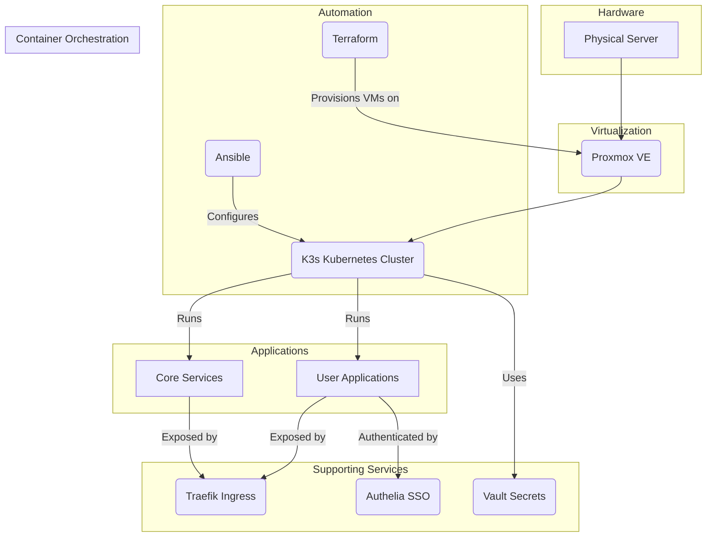
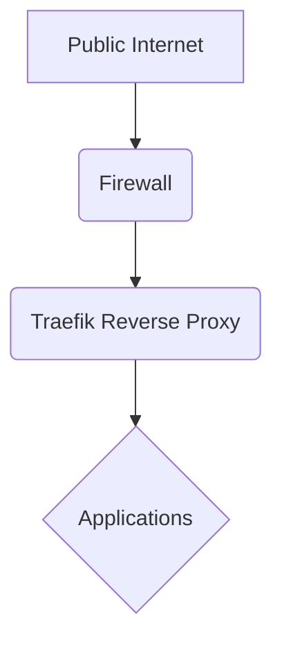
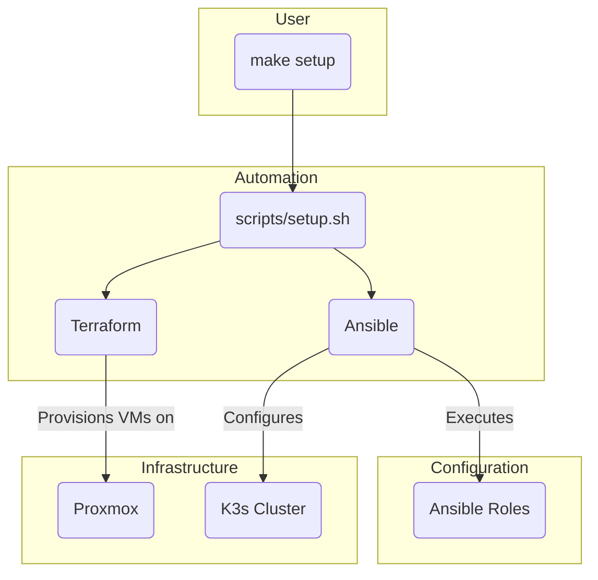

# Homelab as Code

This project uses Ansible to automate the setup of a homelab environment on a Proxmox server. It will provision a K3s cluster and deploy a set of core infrastructure and applications.

The project is designed to be idempotent, meaning it can be run multiple times without causing any unintended side effects. It is also designed to be modular, so you can easily add or remove applications to fit your needs.

## Table of Contents

- [Homelab as Code](#homelab-as-code)
  - [Prerequisites](#prerequisites)
  - [Getting Started](#getting-started)
    - [One-Click Setup](#one-click-setup)
    - [Manual Setup](#manual-setup)
  - [System Architecture](#system-architecture)
    - [Core Components](#core-components)
    - [Architecture Diagram](#architecture-diagram)
  - [Default Services](#default-services)
    - [Core Infrastructure](#core-infrastructure)
    - [Applications](#applications)
  - [Deployment Workflow](#deployment-workflow)
  - [Configuration](#configuration)
    - [Terraform](#terraform)
    - [Terraform Commands](#terraform-commands)
    - [Ansible](#ansible)
  - [Usage](#usage)
  - [Testing](#testing)
  - [OpenLDAP](#openldap)
    - [Configuration](#configuration-1)
  - [Post-Installation](#post-installation)
  - [Stealth VM](#stealth-vm)
    - [Prerequisites](#prerequisites-1)
    - [Usage](#usage-1)
    - [Disclaimer](#disclaimer)
  - [Troubleshooting](#troubleshooting)
    - [Terraform Fails to Apply Changes](#terraform-fails-to-apply-changes)
    - [Ansible Playbook Fails to Run](#ansible-playbook-fails-to-run)
    - [Application Is Not Accessible](#application-is-not-accessible)
    - [Restarting the Setup Process](#restarting-the-setup-process)
  - [Customization](#customization)
    - [Adding New Applications](#adding-new-applications)
    - [Managing Secrets](#managing-secrets)
    - [Configuring Network Settings](#configuring-network-settings)
    - [Using Different Cloud-Init Templates](#using-different-cloud-init-templates)
  - [Contributing](#contributing)
  - [GitHub Actions](#github-actions)
    - [Promote to Staging](#promote-to-staging)

## Prerequisites

Before you begin, you will need the following:

-   A **Proxmox server** with a cloud-init template for your desired operating system.
-   **Ansible** and **Terraform** installed on your local machine.
-   A **password manager** such as Bitwarden or 1Password to store your secrets.
-   An **API token** for your Proxmox server.

## Getting Started

These instructions will guide you through setting up the homelab environment on your Proxmox server.

### 1. Clone the Repository

```bash
git clone [https://github.com/toxicoder/homelabeazy.git](https://github.com/toxicoder/homelabeazy.git)
cd homelabeazy
````

### 2\. Automated Setup (Recommended)

The `make setup-homelab` command is the easiest way to get started. It will automatically provision the infrastructure, configure secrets, and deploy the applications with minimal user interaction.

```bash
make setup-homelab
```

This will run the `scripts/setup.sh` script, which will guide you through the following steps:

1.  **Configuration:** The script will create a `config/` directory by copying the contents of the `config.example/` directory. This is where all your personalized configuration will be stored.

2.  **Proxmox Credentials:** You will be prompted to enter your Proxmox API URL, Token ID, and Token Secret. These are used by Terraform to provision the virtual machines and are stored in `infrastructure/proxmox/terraform.tfvars`.

3.  **Domain Name:** You will be prompted to enter the domain name for your homelab. This will be used to configure DNS and access your applications. This is stored in `config/config.yml`.

4.  **Secret Management:** The script will use the `secure-gen` script to generate any secrets defined in `config/config.yml` and store them in Vault.

5.  **Infrastructure Provisioning:** The script will run Terraform to provision the virtual machines for the K3s cluster.

6.  **Application Deployment:** The script will run Ansible to deploy the applications and configure them with the secrets you provided.

**Detailed Explanation of the Automated Setup Process:**

The automated setup process is designed to be both user-friendly and educational. Here's a detailed breakdown of what happens under the hood:

  * **`scripts/setup.sh`:** This is the main script that orchestrates the entire setup process. It uses a series of helper scripts and Ansible playbooks to perform the necessary tasks.

  * **Terraform for Infrastructure:** The script uses Terraform to create the virtual machines on Proxmox. The Terraform configuration is located in the `infrastructure/proxmox` directory. The `main.tf` file defines the resources to be created, and the `variables.tf` file defines the variables that can be customized.

  * **Ansible for Configuration:** Once the infrastructure is provisioned, the script uses Ansible to configure the K3s cluster and deploy the applications. The Ansible playbooks are located in the `ansible/playbooks` directory.

  * **Vault for Secret Management:** The script uses the `ansible/roles/vault-secrets-operator` role to manage secrets. This role will:

      * Find all the `values.yaml` files in the `config/apps` directory.
      * Parse the `values.yaml` files and identify any values that start with `vault:`.
      * Use the `community.hashi_vault.vault_kv2_get` module to fetch the secrets from Vault.
      * Create Kubernetes secrets with the fetched values.

  * **Application Configuration:** The configuration for each application is defined in a `values.yaml` file located in the `config/apps/<app-name>` directory. These files are used by Helm to deploy the applications with the correct configuration.

### 3\. Manual Setup

The manual setup process is for advanced users who want to customize the installation. This process gives you more control over the configuration of the infrastructure and applications.

1.  **Create your configuration:**

    - Copy the `config.example` directory to `config`:
      ```bash
      cp -r config.example/ config/
      ```
    - Edit `config/config.yml` to match your environment. This file is the central place for all your configuration.

2.  **Provision the infrastructure:**

      - Create a `infrastructure/proxmox/terraform.tfvars` file with your Proxmox credentials.
      - Initialize Terraform:
        ```bash
        make terraform-init
        ```
      - Plan the deployment:
        ```bash
        make terraform-plan
        ```
      - Apply the changes:
        ```bash
        make terraform-apply
        ```

4.  **Manage Secrets:**

This project uses HashiCorp Vault to manage secrets. The `ansible/roles/vault-secrets-operator` role is responsible for deploying the [HashiCorp Vault Secrets Operator](https://www.vaultproject.io/docs/platform/k8s/vso), which in turn is responsible for reading the application configurations, fetching secrets from Vault, and creating the necessary Kubernetes secrets.

**How it Works:**

1.  **Configuration:** The configuration for each application is defined in a `values.yaml` file located in the `config/apps/<app-name>` directory.
2.  **Secret Declaration:** Within these `values.yaml` files, secrets are declared using the following format:
    ` yaml some_secret: "vault:secret/data/path/to/secret#key"  `
      * `vault:`: This prefix indicates that the value is a secret to be fetched from Vault.
      * `secret/data/path/to/secret`: This is the path to the secret in Vault's KVv2 secrets engine.
      * `key`: This is the key of the secret to retrieve.
3.  **Ansible Role:** The `ansible/roles/vault-secrets-operator` Ansible role performs the following actions:
      * Deploys the [HashiCorp Vault Secrets Operator](https://www.vaultproject.io/docs/platform/k8s/vso) to the Kubernetes cluster.

**Example:**

Let's say you have the following configuration in `config/apps/gitea/values.yaml`:

```yaml
gitea:
  admin:
    existingSecret: "vault:secret/data/gitea#admin_creds"
```

The `vault-secrets-operator` will:

1.  Identify that `gitea.admin.existingSecret` is a Vault secret.
2.  Fetch the value of the `admin_creds` key from the `secret/data/gitea` path in Vault.
3.  Create a Kubernetes secret named `gitea-secrets` with the fetched value.

**Adding New Secrets:**

To add a new secret, you need to:

1.  Add the secret to Vault at the desired path.
2.  Update the corresponding `values.yaml` file to reference the new secret using the `vault:` prefix.
3.  Run the `make ansible-playbook-setup` command to apply the changes.

**Private Gitea Setup**

This repository is designed to be used as a template. You can clone it from GitHub, and then push it to your own private Gitea instance to store your homelab's configuration securely.

**Follow these steps to set up your private repository:**

1.  **Clone the repository from GitHub:**

    ```bash
    git clone [https://github.com/toxicoder/homelabeazy.git](https://github.com/toxicoder/homelabeazy.git)
    cd homelabeazy
    ```

2.  **Copy and customize the example configurations:**
    This repository comes with example configuration files. You'll need to copy them and customize them for your own environment.

      - `config.example/`: This directory contains example application configurations. You should create a `config/` directory and copy the contents of `config.example/` into it. The `config/` directory is ignored by git, so you can store your private configurations there.
        ```bash
        cp -r config.example/ config/
        ```
      - `ansible/group_vars/all.yml`: This file contains global variables for Ansible. You can edit this file to customize your deployment.
      - `ldap.toml`: This is the configuration file for LDAP. Copy `ldap.toml.example` to `ldap.toml` and edit it.
        ```bash
        cp ldap.toml.example ldap.toml
        ```
      - `infrastructure/proxmox/terraform.tfvars`: This file contains the variables for Terraform. Copy `infrastructure/proxmox/terraform.tfvars.example` to `infrastructure/proxmox/terraform.tfvars` and edit it.
        ```bash
        cp infrastructure/proxmox/terraform.tfvars.example infrastructure/proxmox/terraform.tfvars
        ```

3.  **Set up your private Gitea repository:**

      - Create a new private repository in your Gitea instance.
      - Add your Gitea repository as a new remote:
        ```bash
        git remote set-url origin <your-gitea-repo-url>
        ```
      - Push the code to your Gitea repository:
        ```bash
        git push -u origin main
        ```

### Application Configuration

The configuration for each application is defined in a `values.yaml` file located in the `config/apps/<app-name>` directory. These files are standard Helm values files, so you can use any valid Helm syntax. You can also use variables from the `config/config.yml` file in these `values.yaml` files.

**Customizing Application Configuration:**

To customize the configuration of an application, you can edit its `values.yaml` file. For example, to change the number of replicas for Gitea, you would edit `config/apps/gitea/values.yaml` and modify the `replicaCount` value.

After making your changes, you can apply them by running the following command:

```bash
make ansible-playbook-main
```

This will re-run the Ansible playbook and update the application with the new configuration.

## System Architecture

This homelab is built on a foundation of Proxmox for virtualization, with Terraform and Ansible for infrastructure as code. The core of the homelab is a K3s cluster, which is a lightweight, certified Kubernetes distribution.

The architecture is designed to be highly available and scalable. The K3s cluster is deployed in a high-availability configuration with multiple master and worker nodes. This ensures that the cluster will remain operational even if one of the nodes fails. The applications are deployed as microservices, which allows them to be scaled independently of each other.

### Core Components

  - **Proxmox:** A powerful open-source virtualization platform that provides the foundation for the homelab.
  - **Terraform:** Used to provision the virtual machines for the K3s cluster on Proxmox.
  - **Ansible:** Used for configuration management and application deployment on the K3s cluster.
  - **K3s:** A lightweight, certified Kubernetes distribution that is easy to install and manage.
  - **Homelab Role:** A comprehensive Ansible role that deploys and configures the entire homelab.
  - **Traefik:** A modern reverse proxy and load balancer that makes deploying microservices easy.
  - **Authelia:** An open-source authentication and authorization server providing two-factor authentication and single sign-on.
  - **OpenLDAP:** A lightweight directory access protocol for user authentication.
  - **Vault:** A tool for securely accessing secrets.
  - **Velero:** A tool for backing up and restoring your Kubernetes cluster resources and persistent volumes.
  - **EFK Stack:** A centralized logging solution consisting of Elasticsearch, Fluentd, and Kibana.

### Networking

This homelab uses a VLAN-based network segmentation strategy to isolate different types of traffic. This is a fundamental security best practice that helps to prevent lateral movement in the event of a security breach.

The following VLANs are defined:

  * **VLAN 10 (Service Network):** This network is used for the services running in the homelab, such as the K3s cluster and other applications.
  * **VLAN 20 (Guest Network):** This network is used for guest devices and is isolated from the rest of the network.
  * **VLAN 30 (Management Network):** This network is used for managing the Proxmox host and other infrastructure components.

Service discovery is provided by Consul. All services are automatically registered with Consul, which allows them to discover each other and communicate securely.

Firewall rules are managed by pfSense. The firewall is configured to allow traffic between the VLANs according to a set of predefined rules.

For more detailed information about the networking setup, please see the [networking documentation](infrastructure/proxmox/networking/README.md).

### System Architecture Diagram



### System Architecture Walkthrough

The system architecture is designed to be a robust, scalable, and automated homelab environment. Here’s a step-by-step walkthrough of the diagram, explaining the role and value of each component:

1.  **Hardware (Physical Server):**

      - **Component:** `Physical Server`
      - **Role:** This is the foundation of the entire homelab, providing the necessary compute, memory, and storage resources.
      - **Value:** A dedicated physical server ensures that all virtualized components have direct access to high-performance hardware, leading to better overall performance and stability.

2.  **Virtualization (Proxmox VE):**

      - **Component:** `Proxmox VE`
      - **Role:** Proxmox is an open-source virtualization platform that runs on the physical server. It allows for the creation and management of virtual machines (VMs) and containers.
      - **Value:** Proxmox enables efficient hardware utilization by allowing multiple isolated environments to run on a single physical machine. This is crucial for creating a flexible and scalable infrastructure.

3.  **Automation (Terraform & Ansible):**

      - **Component:** `Terraform` & `Ansible`
      - **Role:**
          - `Terraform` is used to provision the virtual machines on Proxmox. It defines the infrastructure as code, making it easy to create, modify, and destroy VMs in a repeatable manner.
          - `Ansible` is used for configuration management. Once the VMs are provisioned, Ansible configures them, installs the necessary software, and deploys the applications.
      - **Value:** This combination of tools automates the entire setup process, reducing manual effort and ensuring consistency. It allows you to rebuild the entire homelab from scratch with minimal intervention.

4.  **Container Orchestration (K3s Kubernetes Cluster):**

      - **Component:** `K3s Kubernetes Cluster`
      - **Role:** K3s is a lightweight, certified Kubernetes distribution that runs on the VMs. It orchestrates the deployment, scaling, and management of containerized applications.
      - **Value:** Kubernetes provides a powerful and standardized platform for running applications. It offers high availability, fault tolerance, and automatic scaling, making the homelab resilient and easy to manage.

5.  **Applications (Core Services & User Applications):**

      - **Component:** `Core Services` & `User Applications`
      - **Role:** The K3s cluster runs two types of applications:
          - `Core Services`: These are essential infrastructure components like monitoring, logging, and security services.
          - `User Applications`: These are the end-user applications that you want to run in your homelab, such as a password manager, Git service, or home automation platform.
      - **Value:** This separation allows you to manage the core infrastructure independently of the applications, making it easier to update and maintain both.

6.  **Supporting Services (Traefik, Authelia, Vault):**

      - **Component:** `Traefik Ingress`, `Authelia SSO`, `Vault Secrets`
      - **Role:**
          - `Traefik Ingress`: A reverse proxy and load balancer that manages external access to the applications running in the cluster.
          - `Authelia SSO`: Provides single sign-on and two-factor authentication for the applications, enhancing security.
          - `Vault Secrets`: A secure storage for secrets like API keys, passwords, and certificates.
      - **Value:** These services provide essential functionality for managing and securing the applications. Traefik simplifies routing, Authelia centralizes authentication, and Vault protects sensitive information.

### General Flow of the System

1.  **Provisioning:** `Terraform` provisions the virtual machines on `Proxmox`.
2.  **Configuration:** `Ansible` configures the VMs and installs the `K3s Kubernetes Cluster`.
3.  **Deployment:** `Ansible` deploys the `Core Services` and `User Applications` to the `K3s` cluster.
4.  **Access:**
      - Users access the applications through the `Traefik Ingress`.
      - `Authelia SSO` intercepts the requests to handle authentication.
5.  **Secrets Management:** The applications and the cluster use `Vault` to securely retrieve their secrets.

### Network Architecture



### Code Execution Flow



## Default Services

The following services are included in this homelab. Some are enabled by default, while others are optional and can be enabled by modifying the `ansible/group_vars/all.yml` file.

### Core Infrastructure

| Service           | Description                                                                                             | Enabled by Default |
| ----------------- | ------------------------------------------------------------------------------------------------------- | ------------------ |
| **Traefik** | A modern reverse proxy and load balancer that makes deploying microservices easy.                       | Yes                |
| **Authelia** | An open-source authentication and authorization server providing two-factor authentication and single sign-on. | Yes                |
| **OpenLDAP** | A lightweight directory access protocol for user authentication.                                        | Yes                |
| **Vault** | A tool for securely accessing secrets.                                                                  | Yes                |
| **Velero** | A tool for backing up and restoring your Kubernetes cluster resources and persistent volumes.           | Yes                |
| **EFK Stack** | A centralized logging solution consisting of Elasticsearch, Fluentd, and Kibana.                      | Yes                |

### Applications

| Service           | Description                                                                                             | Enabled by Default |
| ----------------- | ------------------------------------------------------------------------------------------------------- | ------------------ |
| **Bitwarden** | A self-hosted password manager.                                                                         | Yes                |
| **Gitea** | A self-hosted Git service.                                                                              | Yes                |
| **Homepage** | A simple, a static homepage for your homelab.                                                             | Yes                |
| **Coder** | A remote development environment that runs on your own infrastructure.                                  | Yes                |
| **Gluetun** | A VPN client in a container to secure other services.                                                   | Yes                |
| **Grafana** | A monitoring and observability platform.                                                                | Yes                |
| **Home Assistant**| An open-source home automation platform.                                                                | Yes                |
| **Kasm** | A container streaming platform for running desktops and applications in a browser.                      | Yes                |
| **MariaDB** | A popular open-source relational database.                                                              | Yes                |
| **Monitoring** | A full monitoring stack including Prometheus, Grafana, and Alertmanager.                                | Yes                |
| **pfSense** | A powerful open-source firewall and router.                                                             | Yes                |
| **Pi-hole** | A network-wide ad blocker.                                                                              | Yes                |
| **Puter** | A self-hosted cloud desktop.                                                                            | Yes                |
| **Redis** | An in-memory data structure store.                                                                      | Yes                |
| **SearXNG** | A privacy-respecting, hackable metasearch engine.                                                       | Yes                |
| **Supabase** | An open-source Firebase alternative.                                                                    | Yes                |
| **Tailscale** | A zero-config VPN for building secure networks.                                                         | Yes                |
| **WireGuard** | A fast, modern, and secure VPN tunnel.                                                                  | Yes                |

## Deployment

This project uses Terraform workspaces to manage multiple environments. Each workspace represents a different environment (e.g., `dev`, `staging`, `prod`). The current workspace is determined by the `TF_WORKSPACE` environment variable.

### Environments

  * **dev:** The development environment. This is the default workspace. It is used for testing new features and changes.
  * **staging:** The staging environment. This workspace is used for testing changes before they are deployed to production.
  * **prod:** The production environment. This workspace is used for the live application.

### Managing Environments

You can switch between workspaces using the `terraform workspace select` command.

```bash
terraform workspace select <workspace-name>
```

For example, to switch to the `staging` workspace, you would run the following command:

```bash
terraform workspace select staging
```

### Promoting to Staging

To promote the current version of the `main` branch to the staging environment, you can manually trigger the `Promote to Staging` workflow.

1.  Go to the "Actions" tab of the repository.
2.  Select the "Promote to Staging" workflow.
3.  Click the "Run workflow" button.

### Promoting to Production

To promote the current version of the `staging` branch to the production environment, you can manually trigger the `Promote to Production` workflow. This workflow will merge the `staging` branch into the `main` branch and then deploy the changes to the production environment.

1.  Go to the "Actions" tab of the repository.
2.  Select the "Promote to Production" workflow.
3.  Click the "Run workflow" button.

## Deployment Workflow

This project uses a two-step process to deploy the homelab environment:

1.  **Provision Infrastructure:** Use Terraform to create the virtual machines for the K3s cluster on Proxmox. This step is automated by the `scripts/setup.sh` script, which will create a `terraform.tfvars` file with your Proxmox credentials and then run `terraform init`, `terraform plan`, and `terraform apply`.

2.  **Configure Cluster and Applications:** Use Ansible to configure the K3s cluster, install core infrastructure components, and deploy applications. This step is also automated by the `scripts/setup.sh` script, which will create an `ansible/group_vars/all.yml` file with your domain name and then run the Ansible playbook.

The deployment process is designed to be as automated as possible. However, you can also run the Terraform and Ansible commands manually if you want more control over the deployment process.

## Configuration

### Terraform

1.  **Navigate to the Terraform directory:**

    ```bash
    cd infrastructure/proxmox
    ```

2.  **Create a `terraform.tfvars` file:**

    Copy the `terraform.tfvars.example` file to `terraform.tfvars` and edit it to match your environment.

    ```bash
    cp terraform.tfvars.example terraform.tfvars
    ```

    | Variable              | Description                                                                 |
    | --------------------- | --------------------------------------------------------------------------- |
    | `proxmox_api_url`     | The URL of your Proxmox API.                                                |
    | `pm_token_id`         | Your Proxmox API token ID.                                                  |
    | `pm_token_secret`     | Your Proxmox API token secret.                                              |
    | `proxmox_host`        | The name of the Proxmox node to deploy to.                                  |
    | `template_name`       | The name of the cloud-init template to use.                                 |
    | `k3s_master_count`    | The number of K3s master nodes to create.                                   |
    | `k3s_worker_count`    | The number of K3s worker nodes to create.                                   |
    | `ssh_public_key`      | Your SSH public key for accessing the nodes.                                |

### Terraform Commands

  - **Initialize Terraform:**

    ```bash
    terraform init
    ```

    This command initializes the Terraform working directory, downloading the necessary provider plugins.

  - **Plan the deployment:**

    ```bash
    terraform plan
    ```

    This command creates an execution plan, which lets you preview the changes that Terraform plans to make to your infrastructure.

  - **Apply the changes:**

    ```bash
    terraform apply
    ```

    This command applies the changes required to reach the desired state of the configuration.

  - **Destroy the infrastructure:**

    ```bash
    terraform destroy
    ```

    This command destroys all of the resources created by Terraform.

### Ansible

1.  **Configure Ansible variables:**

    Edit the `ansible/group_vars/all.yml` file to set your domain name, user passwords, and other application-specific configuration options.

2.  **Inventory (auto-generated):**

    The Ansible inventory is now automatically generated by Terraform. After you run `terraform apply`, a file named `inventory.auto.yml` will be created in the `ansible/inventory` directory. This file contains the IP addresses and other information about the nodes that were created.

## Usage

This project includes a `Makefile` that provides a convenient way to run common tasks.

### Makefile Commands

  - **`make help`**: Display a list of available commands.
  - **`make install-deps`**: Install dependencies and setup pre-commit.
  - **`make setup-homelab`**: Run the interactive setup script for the homelab.
  - **`make lint`**: Run all linters.
  - **`make terraform-init`**: Initialize Terraform.
  - **`make terraform-plan`**: Plan the Terraform deployment.
  - **`make terraform-apply`**: Apply the Terraform deployment.
  - **`make ansible-playbook-main`**: Run the main Ansible playbook.
  - **`make test`**: Run Molecule tests for all Ansible roles.
  - **`make clean`**: Clean up temporary files.

## Testing

This project uses Molecule to lint and syntax check the Ansible roles.

1.  **Install the testing dependencies:**

    ```bash
    pip install -r ansible/requirements.txt
    ansible-galaxy collection install -r ansible/requirements.yml
    ```

2.  **Run the tests for a specific role:**

    ```bash
    cd ansible/roles/<role_name>
    molecule test
    ```

## OpenLDAP

This repository includes an Ansible role for deploying OpenLDAP to the Kubernetes cluster. The role can be found in `ansible/roles/openldap`.

### Configuration

The OpenLDAP role uses the following variables for configuration:

  - `openldap_root_password`: The password for the OpenLDAP root user.
  - `openldap_admin_password`: The password for the OpenLDAP admin user.

These variables should be set as environment variables before running the Ansible playbook:

```bash
export OPENLDAP_ROOT_PASSWORD="your-root-password"
export OPENLDAP_ADMIN_PASSWORD="your-admin-password"
```

The OpenLDAP application is deployed using the `apps/openldap.yml` manifest. The passwords for the OpenLDAP users are managed by Vault. You will need to add the following secrets to Vault:

  - `secrets/data/openldap`
      - `root-password`
      - `admin-password`

## Post-Installation

After the setup is complete, you will need to perform the following steps to access your new homelab environment:

### 1\. Access Proxmox

You can access the Proxmox web interface by navigating to the IP address of your Proxmox server in your web browser.

### 2\. Access the Kubernetes Cluster

The K3s cluster is now running on your Proxmox server. You can access it by SSHing into one of the master nodes and using the `kubectl` command-line tool. The kubeconfig file is located at `~/.kube/config` on the master node.

### 3\. Configure DNS

You will need to configure DNS for your applications to be accessible at their respective domain names. This can be done by adding DNS records to your DNS provider or by using a local DNS server such as Pi-hole.

**Example: Using Pi-hole for Local DNS**

1.  Log in to your Pi-hole admin interface.
2.  Navigate to "Local DNS" -\> "DNS Records".
3.  Add a new A record for your domain, pointing to the IP address of your Traefik load balancer. For example:

| Domain      | IP Address      |
| ----------- | --------------- |
| `*.example.com` | `192.168.1.100` |

This will resolve all subdomains of `example.com` to the IP address of your Traefik load balancer.

### 4\. Access Applications

Once DNS is configured, you can access the applications by navigating to their respective domain names in your web browser.

**Example: Accessing Grafana**

1.  Open your web browser and navigate to `https://grafana.example.com`.
2.  You will be redirected to the Authelia login page.
3.  Log in with your credentials.
4.  You will then be redirected to the Grafana dashboard.

## Stealth VM

This project includes an optional "stealth" Windows VM on Proxmox for anti-cheat evasion in game streaming. This feature is experimental and should be used with caution.

### Prerequisites

  - Proxmox 8.x+
  - A Windows ISO file
  - The PCI ID of the GPU you want to pass through
  - The MAC address of your physical network card

### Usage

To enable the stealth VM, run the `scripts/setup.sh` script and answer "y" when prompted to enable the stealth VM. You will then be prompted for the Windows ISO path, GPU PCI ID, and real MAC address.

### Disclaimer

This feature is intended for educational purposes only. The use of this feature to circumvent anti-cheat mechanisms may be against the terms of service of some games and could result in a ban. The author of this project is not responsible for any consequences that may arise from the use of this feature.

## Troubleshooting

This section provides solutions to common problems you may encounter during the setup process.

### `scripts/setup.sh` Script Fails

If the `scripts/setup.sh` script fails, it is most likely due to an issue with the Terraform or Ansible commands that it is running. To debug the issue, you can run the commands manually and inspect the output.

1.  **Run Terraform manually:**
    ```bash
    cd terraform
    terraform init
    terraform plan
    terraform apply
    ```
2.  **Run Ansible manually:**
    ```bash
    cd ansible
    ansible-playbook -i inventory/inventory.auto.yml playbooks/main.yml
    ```

### Terraform Fails to Apply Changes

If Terraform fails to apply the changes, it may be due to a problem with your Proxmox environment. Check the following:

  - **Proxmox API Token:** Make sure your Proxmox API token has the correct permissions.
  - **Proxmox Host:** Make sure the Proxmox host is running and accessible.
  - **Cloud-init Template:** Make sure the cloud-init template exists and is configured correctly.

### Ansible Playbook Fails to Run

If the Ansible playbook fails to run, it may be due to a problem with your SSH connection. Check the following:

  - **SSH Key:** Make sure your SSH key is added to your SSH agent.
  - **SSH Connection:** Make sure you can connect to the nodes using SSH.

### Application Is Not Accessible

If an application is not accessible, it may be due to a problem with the Traefik Ingress controller or the application itself.

  - **Check the Traefik Dashboard:** The Traefik dashboard will show you the status of your Ingress routes and whether there are any errors.
  - **Check the Application Logs:** Use `kubectl logs` to check the logs of the application's pods. This will often give you a clue as to what is wrong.
    ```bash
    kubectl logs -l app=<app-name>
    ```
  - **Check the Ingress Route:** Make sure the Ingress route for the application is configured correctly.
    ```bash
    kubectl get ingressroute -n <namespace>
    ```
  - **Check DNS:** Make sure the DNS record for the application is pointing to the correct IP address.

### Restarting the Setup Process

If you encounter an issue that you cannot resolve, you can restart the setup process from the beginning.

1.  **Destroy the infrastructure:**

    ```bash
    terraform destroy
    ```

2.  **Delete the `terraform.tfvars` file:**

    ```bash
    rm terraform/terraform.tfvars
    ```

3.  **Delete the `ansible/group_vars/all.yml` file:**

    ```bash
    rm ansible/group_vars/all.yml
    ```

4.  **Run the setup script again:**

    ```bash
    ./scripts/setup.sh
    ```

## Customization

This project is highly customizable. You can add new applications, manage secrets, and configure network settings to fit your needs.

### Adding New Applications

To add a new application, you will need to create a new Ansible role for it. The role should include the following:

  - A `tasks/main.yml` file that defines the tasks for deploying the application.
  - A `templates` directory that contains any necessary configuration files.
  - A `defaults/main.yml` file that defines the default variables for the application.

Once you have created the role, you can add it to the `ansible/playbooks/main.yml` file to have it deployed with the rest of the applications.

### Managing Secrets

This project uses Vault to manage secrets by default. The `secure-gen` script will automatically generate any secrets defined in the `secrets_to_generate` section of your `config/config.yml` file and store them in Vault.

### Configuring Network Settings

All network settings can be configured in the `config/config.yml` file.

### Using Different Cloud-Init Templates

This project uses a cloud-init template to configure the virtual machines. You can use a different cloud-init template by modifying the `template_name` variable in the `terraform/terraform.tfvars` file.

## Contributing

Contributions are welcome\! If you would like to contribute to this project, please follow these steps:

1.  **Open an issue:** Before you start working on a new feature or bug fix, please open an issue to discuss it with the project maintainers. This will help to ensure that your contribution is in line with the project's goals.
2.  **Fork the repository:** Fork the repository to your own GitHub account.
3.  **Create a new branch:** Create a new branch for your changes.
4.  **Make your changes:** Make your changes and commit them with a clear and concise commit message.
5.  **Push your changes:** Push your changes to your fork.
6.  **Create a pull request:** Create a pull request to merge your changes into the `main` branch.

## GitHub Actions

This project uses GitHub Actions to automate the CI/CD process.

### Promote to Staging

To promote the current version of the `main` branch to the staging environment, you can manually trigger the `Promote to Staging` workflow.

1.  Go to the "Actions" tab of the repository.
2.  Select the "Promote to Staging" workflow.
3.  Click the "Run workflow" button.

## License

This project is licensed under the MIT License. See the [LICENSE](LICENSE) file for details.
