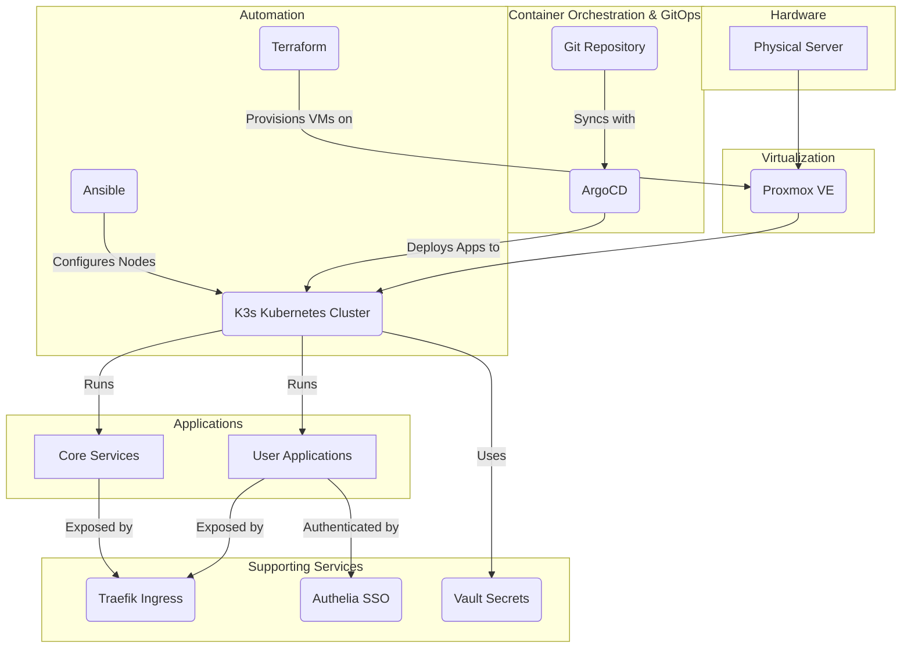

# Homelab as Code

This project automates the setup of a homelab environment on a Proxmox server using a combination of Terraform, Ansible, and ArgoCD. It provisions a K3s cluster, configures the nodes, and deploys a suite of applications using a GitOps approach.

The project is designed to be idempotent and modular, allowing you to easily customize your homelab by adding or removing applications to fit your needs.

## Architecture Diagram



## Prerequisites

Before you begin, you will need the following:

-   A **Proxmox server** with a cloud-init template for your desired operating system.
-   **Terraform** and **Ansible** installed on your local machine.
-   **[yq](https://github.com/mikefarah/yq#install)** for processing YAML files.
-   **[kubectl](https://kubernetes.io/docs/tasks/tools/install-kubectl/)** to interact with the Kubernetes cluster.
-   **[argocd](https://argo-cd.readthedocs.io/en/stable/cli_installation/)** CLI (optional) for managing ArgoCD from the command line.
-   An **API token** for your Proxmox server.
-   A **password manager** such as Bitwarden or 1Password to store your secrets.

## Getting Started

These instructions will guide you through setting up the homelab environment on your Proxmox server. The automated `make setup` command is currently not recommended as it follows an outdated workflow. Please follow the manual steps below for a successful deployment.

### 1. Clone the Repository

```bash
git clone https://github.com/toxicoder/homelabeazy.git
cd homelabeazy
```

### 2. Configure Your Environment

1.  **Copy the example configuration:**
    ```bash
    cp -r config.example/ config/
    ```
2.  **Edit `config/config.yml`:**
    - This file is the central place for all your configuration. Review the variables and adjust them to your needs.
3.  **Create `terraform.tfvars`:**
    - Copy the example file:
      ```bash
      cp infrastructure/proxmox/terraform.tfvars.example infrastructure/proxmox/terraform.tfvars
      ```
    - Edit `infrastructure/proxmox/terraform.tfvars` with your Proxmox API credentials.

### 3. Provision the Infrastructure

Run the following command to provision the virtual machines for the K3s cluster on Proxmox:

```bash
make terraform-apply
```

### 4. Configure the Cluster with Ansible

1.  **Create the Ansible Inventory:**
    - After `terraform apply` is complete, you need to get the IP addresses of the newly created VMs from the Proxmox console.
    - Create a file named `ansible/inventory/inventory.auto.yml` and add the IP addresses in the following format:
      ```yaml
      # ansible/inventory/inventory.auto.yml
      all:
        hosts:
          k3s-master:
            ansible_host: <IP_of_master_node>
          k3s-worker-0:
            ansible_host: <IP_of_worker_node_0>
          # Add more workers if you have them
      ```
2.  **Run the Ansible Playbook:**
    - This will configure the nodes, install K3s, and set up some core components.
    ```bash
    make ansible-playbook-setup
    ```

### 5. Deploy Applications with ArgoCD

This project uses a GitOps approach with ArgoCD to manage applications.

1.  **Install ArgoCD:**
    - If you don't have ArgoCD running on your cluster, you need to install it. You can follow the [official ArgoCD documentation](https://argo-cd.readthedocs.io/en/stable/getting_started/).
2.  **Deploy the App of Apps:**
    - The `apps/app-of-apps.yml` manifest is the entry point for all applications in this repository. Applying this manifest to your cluster will have ArgoCD automatically deploy and manage all the other applications defined in the `apps/` directory.
    - You can apply it using `kubectl`:
      ```bash
      kubectl apply -f apps/app-of-apps.yml
      ```
    - Alternatively, you can create the application using the ArgoCD UI or CLI, pointing it to this Git repository and the `apps/` path.

## Further Documentation

For more detailed information, please see the following documents:

- [Architecture](docs/architecture.md)
- [Configuration](docs/configuration.md)
- [Deployment](docs/deployment.md)
- [Customization](docs/customization.md)
- [Services](docs/services.md)
- [Post-Installation](docs/post-installation.md)
- [Advanced Usage](docs/advanced-usage.md)
- [Troubleshooting](docs/troubleshooting.md)

## Contributing

Please see our [contributing guidelines](CONTRIBUTING.md) for more information.

## License

This project is licensed under the MIT License. See the [LICENSE](LICENSE) file for details.
