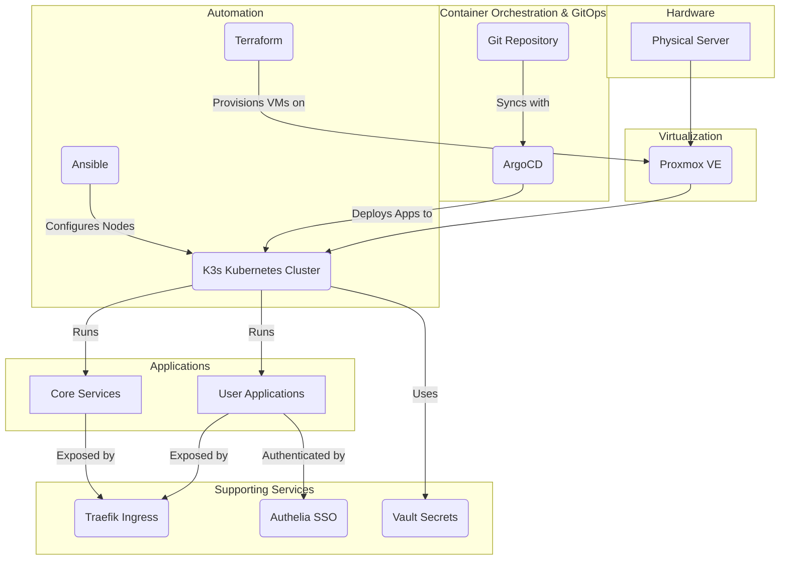

**For full documentation, visit our [GitHub Pages site](https://toxicoder.github.io/homelabeazy).**

# Homelabeazy - Your _Homelab as Code_

<div align="center">
    
</div>

## Project Mission

To bring enterprise-grade automation to the personal homelab. This project provides a complete blueprint to build a powerful, reproducible server environment using professional Infrastructure as Code (IaC) and GitOps practices, allowing you to manage your entire homelab with the same reliability and control as a modern software project.

### Details

This project automates the setup of a homelab environment on a Proxmox server using a combination of:

* **Terraform**
* **Ansible**
* **ArgoCD**.

It:

1. **provisions a K3s cluster**
1. **configures the nodes**
1. **and deploys a suite of applications using a GitOps approach.**

The project is designed to be idempotent and modular, allowing you to easily customize your homelab by adding or removing applications to fit your needs.

## Architecture Diagram



## Prerequisites

Before you begin, you will need the following:

-   A **Proxmox server** with a cloud-init template for your desired operating system.
-   **Terraform** and **Ansible** installed on your local machine.
-   **[yq](https://github.com/mikefarah/yq#install)** for processing YAML files.
-   **[kubectl](https://kubernetes.io/docs/tasks/tools/install-kubectl/)** to interact with the Kubernetes cluster.
-   **[argocd](https://argo-cd.readthedocs.io/en/stable/cli_installation/)** CLI (optional) for managing ArgoCD from the command line.
-   An **API token** for your Proxmox server.
-   A **password manager** such as Bitwarden or 1Password to store your secrets.

## Getting Started

Welcome to Homelabeazy! This guide will walk you through setting up your homelab using an interactive process that is designed to safely import your existing environment without causing disruptions.

The primary method for setting up your homelab is to use a private Git repository to store your configuration. This keeps your sensitive information separate from the public codebase.

### 1. Create a Private Git Repository

Before you begin, create a new **private** Git repository on a service like GitHub, GitLab, or Gitea. You will use this repository to store all of your homelab's configuration.

### 2. Clone the Homelabeazy Repository

Clone this `homelabeazy` repository to your local machine:

```bash
git clone https://github.com/toxicoder/homelabeazy.git
cd homelabeazy
```

### 3. Run the Interactive Setup

The `make setup-interactive` command will guide you through the entire process, from discovering your existing homelab setup to deploying the core services.

```bash
make setup-interactive
```

The script will perform the following steps:

1.  **Prompt for your private repository path:** You'll be asked to provide the local path to the private Git repository you created in step 1.
2.  **Discover existing infrastructure:** The script will run a `homelab-importer` tool to connect to your Proxmox server, discover your existing VMs and containers, and generate Terraform configuration.
3.  **Import to Terraform:** Your existing resources will be imported into Terraform's state, which allows Terraform to manage them without needing to destroy and recreate them.
4.  **Deploy core services:** The script will use Ansible to deploy and configure the core services of your homelab, such as Gitea, Vault, and more.
5.  **Commit to your private repository:** The generated configuration will be committed to your private repository, giving you a complete, version-controlled copy of your homelab's infrastructure and configuration.

After the script completes, your homelab will be fully configured and managed by code.

### 4. Deploying Applications

This project uses a GitOps approach with ArgoCD to manage applications. The interactive setup will install and configure ArgoCD for you. To deploy additional applications, you can add them to the `apps/` directory in your private configuration repository and they will be automatically synced to your cluster.

## Private Deployment

This project is designed to be used with a private deployment model. The `make setup-interactive` command is the recommended way to get started with a private deployment. For more details on the private deployment strategy, please see our [Private Deployment Guide](PRIVATE_DEPLOYMENT.md).

## Documentation

This project's documentation is built with Jekyll and is located in the `docs/` directory.

To view the documentation locally, you will need to have Ruby and Bundler installed. Then, you can run the following commands:

```bash
bundle install
bundle exec jekyll serve
```

The documentation will be available at `http://localhost:4000`.

## Contributing

Please see our [contributing guidelines](CONTRIBUTING.md) for more information.

## License

This project is licensed under the MIT License. See the [LICENSE](LICENSE) file for details.
