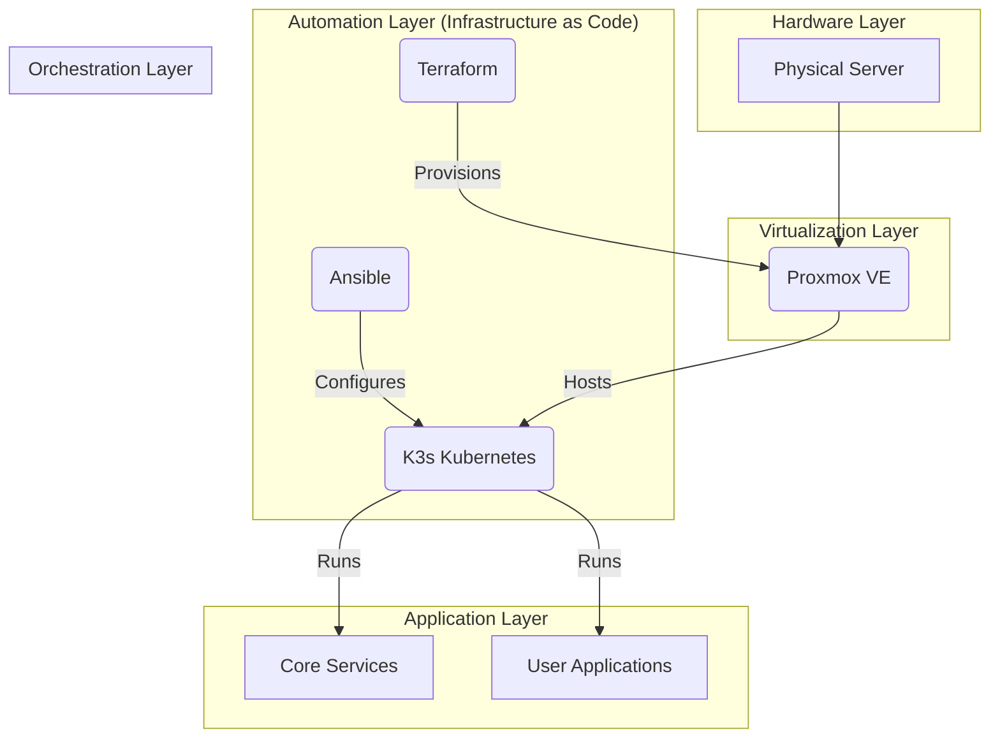
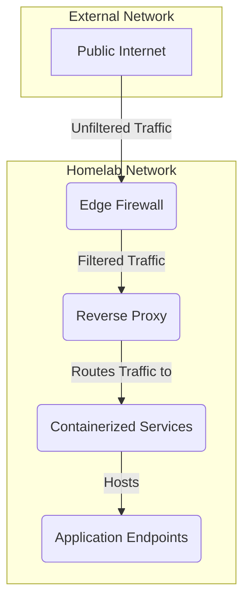

# Homelab as Code

This project uses Ansible to automate the setup of a homelab environment on a Proxmox server. It will provision a K3s cluster and deploy a set of core infrastructure and applications.

The project is designed to be idempotent, meaning it can be run multiple times without causing any unintended side effects. It is also designed to be modular, so you can easily add or remove applications to fit your needs.

## Table of Contents

- [Homelab as Code](#homelab-as-code)
  - [Prerequisites](#prerequisites)
  - [Getting Started](#getting-started)
    - [One-Click Setup](#one-click-setup)
    - [Manual Setup](#manual-setup)
  - [System Architecture](#system-architecture)
    - [Core Components](#core-components)
    - [Architecture Diagram](#architecture-diagram)
  - [Default Services](#default-services)
    - [Core Infrastructure](#core-infrastructure)
    - [Applications](#applications)
  - [Deployment Workflow](#deployment-workflow)
  - [Configuration](#configuration)
    - [Terraform](#terraform)
    - [Terraform Commands](#terraform-commands)
    - [Ansible](#ansible)
  - [Usage](#usage)
  - [Testing](#testing)
  - [OpenLDAP](#openldap)
    - [Configuration](#configuration-1)
  - [Post-Installation](#post-installation)
  - [Stealth VM](#stealth-vm)
    - [Prerequisites](#prerequisites-1)
    - [Usage](#usage-1)
    - [Disclaimer](#disclaimer)
  - [Troubleshooting](#troubleshooting)
    - [Terraform Fails to Apply Changes](#terraform-fails-to-apply-changes)
    - [Ansible Playbook Fails to Run](#ansible-playbook-fails-to-run)
    - [Application Is Not Accessible](#application-is-not-accessible)
    - [Restarting the Setup Process](#restarting-the-setup-process)
  - [Customization](#customization)
    - [Adding New Applications](#adding-new-applications)
    - [Managing Secrets](#managing-secrets)
    - [Configuring Network Settings](#configuring-network-settings)
    - [Using Different Cloud-Init Templates](#using-different-cloud-init-templates)
  - [Contributing](#contributing)
  - [GitHub Actions](#github-actions)
    - [Promote to Staging](#promote-to-staging)

## Prerequisites

Before you begin, you will need the following:

-   A **Proxmox server** with a cloud-init template for your desired operating system.
-   **Ansible** and **Terraform** installed on your local machine.
-   A **password manager** such as Bitwarden or 1Password to store your secrets.
-   An **API token** for your Proxmox server.

## Getting Started

These instructions will guide you through setting up the homelab environment on your Proxmox server.

### 1. Clone the Repository

```bash
git clone https://github.com/your-username/homelab-as-code.git
cd homelab-as-code
```

### 2. Automated Setup (Recommended)

The `setup.sh` script is the easiest way to get started. It will automatically provision the infrastructure and deploy the applications with minimal user interaction.

```bash
./setup.sh
```

This script will prompt you for the following information:

-   **Proxmox API URL:** The URL of your Proxmox API.
-   **Proxmox API Token ID:** Your Proxmox API token ID.
-   **Proxmox API Token Secret:** Your Proxmox API token secret.
-   **Domain Name:** The domain name for your homelab.

The script will then perform the following actions:

-   Create a `terraform.tfvars` file with your Proxmox credentials.
-   Run `terraform init`, `terraform plan`, and `terraform apply` to provision the infrastructure.
-   Create an `ansible/group_vars/all.yml` file with your domain name.
-   Run the Ansible playbook to deploy the applications.

**Note:** If you want to manage your secrets manually, you can run the script with the `--no-vault` flag. This will skip the Vault setup and allow you to enter your secrets manually.

```bash
./setup.sh --no-vault
```

### 3. Manual Setup

The manual setup process is for advanced users who want to customize the installation. This process gives you more control over the configuration of the infrastructure and applications.

1.  **Configure Terraform:**

    - Navigate to the `terraform` directory.
    - Create a `terraform.tfvars` file by copying the example:
      ```bash
      cp terraform.tfvars.example terraform.tfvars
      ```
    - Edit `terraform.tfvars` to match your environment.

2.  **Provision the infrastructure:**

    - Initialize Terraform:
      ```bash
      terraform init
      ```
    - Plan the deployment:
      ```bash
      terraform plan
      ```
    - Apply the changes:
      ```bash
      terraform apply
      ```

3.  **Configure Ansible:**

    - Edit `ansible/group_vars/all.yml` to set your domain name, user passwords, and other application-specific configurations.

4.  **Manage Secrets:**

    This project uses Vault to manage secrets by default. However, you can choose to manage your secrets manually.

    -   **With Vault (Default):** If you are using Vault, you will need to add your secrets to the appropriate path in Vault. The Ansible playbook will automatically retrieve the secrets from Vault during the deployment process.
    -   **Without Vault:** If you are not using Vault, you will need to create a `secrets.yml` file in the `ansible/group_vars` directory. This file should contain all of your secrets in the following format:

        ```yaml
        secret_key: "secret_value"
        ```

        You will also need to update the Ansible playbook to retrieve the secrets from this file instead of Vault.

5.  **Run the Ansible playbook:**

    ```bash
    ansible-playbook -i ansible/inventory/inventory.auto.yml ansible/playbooks/setup.yml
    ```

## System Architecture

This homelab is built on a foundation of Proxmox for virtualization, with Terraform and Ansible for infrastructure as code. The core of the homelab is a K3s cluster, which is a lightweight, certified Kubernetes distribution.

The architecture is designed to be highly available and scalable. The K3s cluster is deployed in a high-availability configuration with multiple master and worker nodes. This ensures that the cluster will remain operational even if one of the nodes fails. The applications are deployed as microservices, which allows them to be scaled independently of each other.

### Core Components

- **Proxmox:** A powerful open-source virtualization platform that provides the foundation for the homelab.
- **Terraform:** Used to provision the virtual machines for the K3s cluster on Proxmox.
- **Ansible:** Used for configuration management and application deployment on the K3s cluster.
- **K3s:** A lightweight, certified Kubernetes distribution that is easy to install and manage.
- **Traefik:** A modern reverse proxy and load balancer that makes deploying microservices easy.
- **Authelia:** An open-source authentication and authorization server providing two-factor authentication and single sign-on.
- **OpenLDAP:** A lightweight directory access protocol for user authentication.
- **Vault:** A tool for securely accessing secrets.
- **Velero:** A tool for backing up and restoring your Kubernetes cluster resources and persistent volumes.
- **EFK Stack:** A centralized logging solution consisting of Elasticsearch, Fluentd, and Kibana.

### Architecture Diagram



### Network Architecture



## Default Services

The following services are included in this homelab. Some are enabled by default, while others are optional and can be enabled by modifying the `ansible/group_vars/all.yml` file.

### Core Infrastructure

| Service           | Description                                                                                             | Enabled by Default |
| ----------------- | ------------------------------------------------------------------------------------------------------- | ------------------ |
| **Traefik**       | A modern reverse proxy and load balancer that makes deploying microservices easy.                       | Yes                |
| **Authelia**      | An open-source authentication and authorization server providing two-factor authentication and single sign-on. | Yes                |
| **OpenLDAP**      | A lightweight directory access protocol for user authentication.                                        | Yes                |
| **Vault**         | A tool for securely accessing secrets.                                                                  | Yes                |
| **Velero**        | A tool for backing up and restoring your Kubernetes cluster resources and persistent volumes.           | Yes                |
| **EFK Stack**     | A centralized logging solution consisting of Elasticsearch, Fluentd, and Kibana.                      | Yes                |

### Applications

| Service           | Description                                                                                             | Enabled by Default |
| ----------------- | ------------------------------------------------------------------------------------------------------- | ------------------ |
| **Bitwarden**     | A self-hosted password manager.                                                                         | Yes                |
| **Gitea**         | A self-hosted Git service.                                                                              | Yes                |
| **Homepage**      | A simple, static homepage for your homelab.                                                             | Yes                |
| **Coder**         | A remote development environment that runs on your own infrastructure.                                  | No                 |
| **Gluetun**       | A VPN client in a container to secure other services.                                                   | No                 |
| **Grafana**       | A monitoring and observability platform.                                                                | Yes                |
| **Home Assistant**| An open-source home automation platform.                                                                | No                 |
| **Kasm**          | A container streaming platform for running desktops and applications in a browser.                      | No                 |
| **MariaDB**       | A popular open-source relational database.                                                              | Yes                |
| **Monitoring**    | A full monitoring stack including Prometheus, Grafana, and Alertmanager.                                | Yes                |
| **pfSense**       | A powerful open-source firewall and router.                                                             | No                 |
| **Pi-hole**       | A network-wide ad blocker.                                                                              | No                 |
| **Puter**         | A self-hosted cloud desktop.                                                                            | No                 |
| **Redis**         | An in-memory data structure store.                                                                      | Yes                |
| **SearXNG**       | A privacy-respecting, hackable metasearch engine.                                                       | No                 |
| **Supabase**      | An open-source Firebase alternative.                                                                    | No                 |
| **Tailscale**     | A zero-config VPN for building secure networks.                                                         | No                 |
| **WireGuard**     | A fast, modern, and secure VPN tunnel.                                                                  | No                 |

## Deployment Workflow

This project uses a two-step process to deploy the homelab environment:

1.  **Provision Infrastructure:** Use Terraform to create the virtual machines for the K3s cluster on Proxmox. This step is automated by the `setup.sh` script, which will create a `terraform.tfvars` file with your Proxmox credentials and then run `terraform init`, `terraform plan`, and `terraform apply`.

2.  **Configure Cluster and Applications:** Use Ansible to configure the K3s cluster, install core infrastructure components, and deploy applications. This step is also automated by the `setup.sh` script, which will create an `ansible/group_vars/all.yml` file with your domain name and then run the Ansible playbook.

The deployment process is designed to be as automated as possible. However, you can also run the Terraform and Ansible commands manually if you want more control over the deployment process.

## Configuration

### Terraform

1.  **Navigate to the Terraform directory:**

    ```bash
    cd terraform
    ```

2.  **Create a `terraform.tfvars` file:**

    Copy the `terraform.tfvars.example` file to `terraform.tfvars` and edit it to match your environment.

    ```bash
    cp terraform.tfvars.example terraform.tfvars
    ```

    | Variable              | Description                                                                 |
    | --------------------- | --------------------------------------------------------------------------- |
    | `pm_api_url`          | The URL of your Proxmox API.                                                |
    | `pm_token_id`         | Your Proxmox API token ID.                                                  |
    | `pm_token_secret`     | Your Proxmox API token secret.                                              |
    | `proxmox_host`        | The name of the Proxmox node to deploy to.                                  |
    | `template_name`       | The name of the cloud-init template to use.                                 |
    | `k3s_master_count`    | The number of K3s master nodes to create.                                   |
    | `k3s_worker_count`    | The number of K3s worker nodes to create.                                   |
    | `ssh_public_key`      | Your SSH public key for accessing the nodes.                                |

### Terraform Commands

-   **Initialize Terraform:**

    ```bash
    terraform init
    ```

    This command initializes the Terraform working directory, downloading the necessary provider plugins.

-   **Plan the deployment:**

    ```bash
    terraform plan
    ```

    This command creates an execution plan, which lets you preview the changes that Terraform plans to make to your infrastructure.

-   **Apply the changes:**

    ```bash
    terraform apply
    ```

    This command applies the changes required to reach the desired state of the configuration.

-   **Destroy the infrastructure:**

    ```bash
    terraform destroy
    ```

    This command destroys all of the resources created by Terraform.

### Ansible

1.  **Configure Ansible variables:**

    Edit the `ansible/group_vars/all.yml` file to set your domain name, user passwords, and other application-specific configuration options.

2.  **Inventory (auto-generated):**

    The Ansible inventory is now automatically generated by Terraform. After you run `terraform apply`, a file named `inventory.auto.yml` will be created in the `ansible/inventory` directory. This file contains the IP addresses and other information about the nodes that were created.

## Usage

Once you have provisioned the infrastructure with Terraform and configured the Ansible variables, you can run the main playbook to set up your homelab:

```bash
ansible-playbook -i ansible/inventory/inventory.auto.yml ansible/playbooks/setup.yml
```

This will execute all the roles in the correct order to provision your homelab environment.

## Testing

This project uses Molecule to lint and syntax check the Ansible roles.

1.  **Install the testing dependencies:**

    ```bash
    pip install -r ansible/requirements.txt
    ansible-galaxy collection install -r ansible/requirements.yml
    ```

2.  **Run the tests for a specific role:**

    ```bash
    cd ansible/roles/<role_name>
    molecule test
    ```

    For example, to run the tests for the `core_infra` role:

    ```bash
    cd ansible/roles/core_infra
    molecule test
    ```

## OpenLDAP

This repository includes an Ansible role for deploying OpenLDAP to the Kubernetes cluster. The role can be found in `ansible/roles/openldap`.

### Configuration

The OpenLDAP role uses the following variables for configuration:

- `openldap_root_password`: The password for the OpenLDAP root user.
- `openldap_admin_password`: The password for the OpenLDAP admin user.

These variables should be set as environment variables before running the Ansible playbook:

```bash
export OPENLDAP_ROOT_PASSWORD="your-root-password"
export OPENLDAP_ADMIN_PASSWORD="your-admin-password"
```

The OpenLDAP application is deployed using the `apps/openldap.yml` manifest. The passwords for the OpenLDAP users are managed by Vault. You will need to add the following secrets to Vault:

- `secrets/data/openldap`
  - `root-password`
  - `admin-password`

## Post-Installation

After the setup is complete, you will need to perform the following steps to access your new homelab environment:

### 1. Access Proxmox

You can access the Proxmox web interface by navigating to the IP address of your Proxmox server in your web browser.

### 2. Access the Kubernetes Cluster

The K3s cluster is now running on your Proxmox server. You can access it by SSHing into one of the master nodes and using the `kubectl` command-line tool. The kubeconfig file is located at `~/.kube/config` on the master node.

### 3. Configure DNS

You will need to configure DNS for your applications to be accessible at their respective domain names. This can be done by adding DNS records to your DNS provider or by using a local DNS server such as Pi-hole.

**Example: Using Pi-hole for Local DNS**

1.  Log in to your Pi-hole admin interface.
2.  Navigate to "Local DNS" -> "DNS Records".
3.  Add a new A record for your domain, pointing to the IP address of your Traefik load balancer. For example:

| Domain      | IP Address      |
| ----------- | --------------- |
| `*.example.com` | `192.168.1.100` |

This will resolve all subdomains of `example.com` to the IP address of your Traefik load balancer.

### 4. Access Applications

Once DNS is configured, you can access the applications by navigating to their respective domain names in your web browser.

**Example: Accessing Grafana**

1.  Open your web browser and navigate to `https://grafana.example.com`.
2.  You will be redirected to the Authelia login page.
3.  Log in with your credentials.
4.  You will then be redirected to the Grafana dashboard.

## Stealth VM

This project includes an optional "stealth" Windows VM on Proxmox for anti-cheat evasion in game streaming. This feature is experimental and should be used with caution.

### Prerequisites

- Proxmox 8.x+
- A Windows ISO file
- The PCI ID of the GPU you want to pass through
- The MAC address of your physical network card

### Usage

To enable the stealth VM, run the `setup.sh` script and answer "y" when prompted to enable the stealth VM. You will then be prompted for the Windows ISO path, GPU PCI ID, and real MAC address.

### Disclaimer

This feature is intended for educational purposes only. The use of this feature to circumvent anti-cheat mechanisms may be against the terms of service of some games and could result in a ban. The author of this project is not responsible for any consequences that may arise from the use of this feature.

## Troubleshooting

This section provides solutions to common problems you may encounter during the setup process.

### `setup.sh` Script Fails

If the `setup.sh` script fails, it is most likely due to an issue with the Terraform or Ansible commands that it is running. To debug the issue, you can run the commands manually and inspect the output.

1.  **Run Terraform manually:**
    ```bash
    cd terraform
    terraform init
    terraform plan
    terraform apply
    ```
2.  **Run Ansible manually:**
    ```bash
    cd ansible
    ansible-playbook -i inventory/inventory.auto.yml playbooks/setup.yml
    ```

### Terraform Fails to Apply Changes

If Terraform fails to apply the changes, it may be due to a problem with your Proxmox environment. Check the following:

-   **Proxmox API Token:** Make sure your Proxmox API token has the correct permissions.
-   **Proxmox Host:** Make sure the Proxmox host is running and accessible.
-   **Cloud-init Template:** Make sure the cloud-init template exists and is configured correctly.

### Ansible Playbook Fails to Run

If the Ansible playbook fails to run, it may be due to a problem with your SSH connection. Check the following:

-   **SSH Key:** Make sure your SSH key is added to your SSH agent.
-   **SSH Connection:** Make sure you can connect to the nodes using SSH.

### Application Is Not Accessible

If an application is not accessible, it may be due to a problem with the Traefik Ingress controller or the application itself.

-   **Check the Traefik Dashboard:** The Traefik dashboard will show you the status of your Ingress routes and whether there are any errors.
-   **Check the Application Logs:** Use `kubectl logs` to check the logs of the application's pods. This will often give you a clue as to what is wrong.
    ```bash
    kubectl logs -l app=<app-name>
    ```
-   **Check the Ingress Route:** Make sure the Ingress route for the application is configured correctly.
    ```bash
    kubectl get ingressroute -n <namespace>
    ```
-   **Check DNS:** Make sure the DNS record for the application is pointing to the correct IP address.

### Restarting the Setup Process

If you encounter an issue that you cannot resolve, you can restart the setup process from the beginning.

1.  **Destroy the infrastructure:**

    ```bash
    terraform destroy
    ```

2.  **Delete the `terraform.tfvars` file:**

    ```bash
    rm terraform/terraform.tfvars
    ```

3.  **Delete the `ansible/group_vars/all.yml` file:**

    ```bash
    rm ansible/group_vars/all.yml
    ```

4.  **Run the setup script again:**

    ```bash
    ./setup.sh
    ```

## Customization

This project is highly customizable. You can add new applications, manage secrets, and configure network settings to fit your needs.

### Adding New Applications

To add a new application, you will need to create a new Ansible role for it. The role should include the following:

-   A `tasks/main.yml` file that defines the tasks for deploying the application.
-   A `templates` directory that contains any necessary configuration files.
-   A `defaults/main.yml` file that defines the default variables for the application.

Once you have created the role, you can add it to the `ansible/playbooks/setup.yml` file to have it deployed with the rest of the applications.

### Managing Secrets

This project uses Vault to manage secrets by default. However, you can choose to manage your secrets manually.

-   **With Vault (Default):** If you are using Vault, you will need to add your secrets to the appropriate path in Vault. The Ansible playbook will automatically retrieve the secrets from Vault during the deployment process.
-   **Without Vault:** If you are not using Vault, you will need to create a `secrets.yml` file in the `ansible/group_vars` directory. This file should contain all of your secrets in the following format:

    ```yaml
    secret_key: "secret_value"
    ```

    You will also need to update the Ansible playbook to retrieve the secrets from this file instead of Vault.

### Configuring Network Settings

The network settings for the virtual machines are defined in the `terraform/variables.tf` file. You can modify this file to change the following:

-   The IP address range for the virtual machines.
-   The gateway and DNS servers for the virtual machines.
-   The VLAN tag for the virtual machines.

### Using Different Cloud-Init Templates

This project uses a cloud-init template to configure the virtual machines. You can use a different cloud-init template by modifying the `template_name` variable in the `terraform/terraform.tfvars` file.

## Contributing

Contributions are welcome! If you would like to contribute to this project, please follow these steps:

1.  **Open an issue:** Before you start working on a new feature or bug fix, please open an issue to discuss it with the project maintainers. This will help to ensure that your contribution is in line with the project's goals.
2.  **Fork the repository:** Fork the repository to your own GitHub account.
3.  **Create a new branch:** Create a new branch for your changes.
4.  **Make your changes:** Make your changes and commit them with a clear and concise commit message.
5.  **Push your changes:** Push your changes to your fork.
6.  **Create a pull request:** Create a pull request to merge your changes into the `main` branch.

## GitHub Actions

This project uses GitHub Actions to automate the CI/CD process.

### Promote to Staging

To promote the current version of the `main` branch to the staging environment, you can manually trigger the `Promote to Staging` workflow.

1.  Go to the "Actions" tab of the repository.
2.  Select the "Promote to Staging" workflow.
3.  Click the "Run workflow" button.

## License

This project is licensed under the MIT License. See the [LICENSE](LICENSE) file for details.
