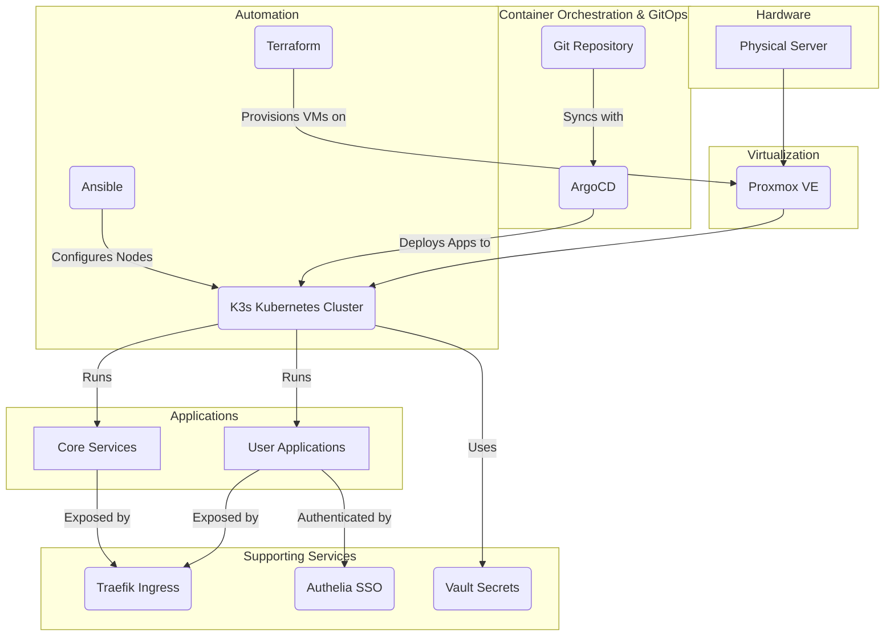
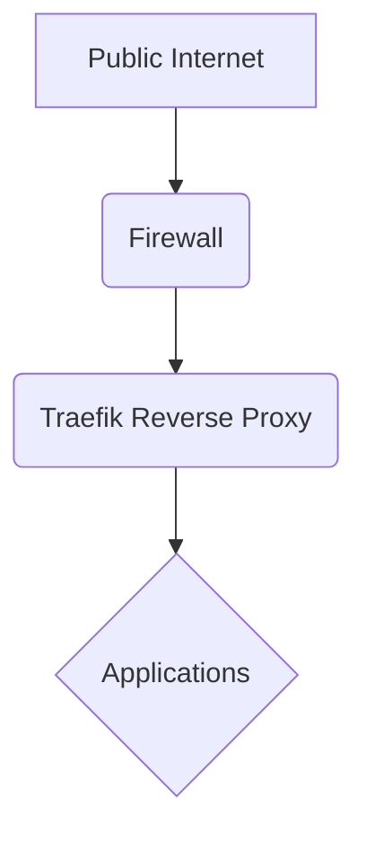
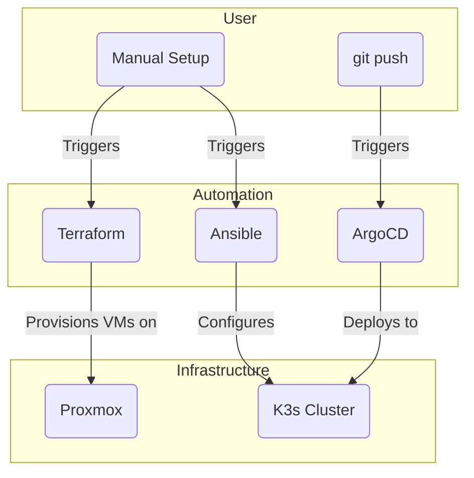

# System Architecture

This homelab is built on a foundation of Proxmox for virtualization, with Terraform and Ansible for infrastructure provisioning and node configuration. Applications are managed using a GitOps workflow with ArgoCD. The core of the homelab is a K3s cluster, which is a lightweight, certified Kubernetes distribution.

## Core Components

  - **Proxmox:** A powerful open-source virtualization platform that provides the foundation for the homelab.
  - **Terraform:** Used to provision the virtual machines for the K3s cluster on Proxmox.
  - **Ansible:** Used for configuration management of the K3s nodes.
  - **ArgoCD:** A declarative, GitOps continuous delivery tool for Kubernetes. It is used to deploy and manage applications.
  - **K3s:** A lightweight, certified Kubernetes distribution that is easy to install and manage.
  - **Traefik:** A modern reverse proxy and load balancer that makes deploying microservices easy.
  - **Authelia:** An open-source authentication and authorization server providing two-factor authentication and single sign-on.
  - **OpenLDAP:** A lightweight directory access protocol for user authentication.
  - **Vault:** A tool for securely accessing secrets.
  - **Velero:** A tool for backing up and restoring your Kubernetes cluster resources and persistent volumes.
  - **EFK Stack:** A centralized logging solution consisting of Elasticsearch, Fluentd, and Kibana.

## Networking

This homelab uses a VLAN-based network segmentation strategy to isolate different types of traffic. This is a fundamental security best practice that helps to prevent lateral movement in the event of a security breach.

The following VLANs are defined:

  * **VLAN 10 (Service Network):** This network is used for the services running in the homelab, such as the K3s cluster and other applications.
  * **VLAN 20 (Guest Network):** This network is used for guest devices and is isolated from the rest of the network.
  * **VLAN 30 (Management Network):** This network is used for managing the Proxmox host and other infrastructure components.

Service discovery is provided by Consul. All services are automatically registered with Consul, which allows them to discover each other and communicate securely.

Firewall rules are managed by pfSense. The firewall is configured to allow traffic between the VLANs according to a set of predefined rules.

For more detailed information about the networking setup, please see the [networking documentation](infrastructure/proxmox/networking/README.md).

## System Architecture Diagram

## System Architecture Walkthrough

The system architecture is designed to be a robust, scalable, and automated homelab environment. Here’s a step-by-step walkthrough of the diagram, explaining the role and value of each component:

1.  **Hardware (Physical Server):**

      - **Component:** `Physical Server`
      - **Role:** This is the foundation of the entire homelab, providing the necessary compute, memory, and storage resources.
      - **Value:** A dedicated physical server ensures that all virtualized components have direct access to high-performance hardware, leading to better overall performance and stability.

2.  **Virtualization (Proxmox VE):**

      - **Component:** `Proxmox VE`
      - **Role:** Proxmox is an open-source virtualization platform that runs on the physical server. It allows for the creation and management of virtual machines (VMs) and containers.
      - **Value:** Proxmox enables efficient hardware utilization by allowing multiple isolated environments to run on a single physical machine. This is crucial for creating a flexible and scalable infrastructure.

3.  **Automation (Terraform & Ansible):**

      - **Component:** `Terraform` & `Ansible`
      - **Role:**
          - `Terraform` is used to provision the virtual machines on Proxmox. It defines the infrastructure as code, making it easy to create, modify, and destroy VMs in a repeatable manner.
          - `Ansible` is used for configuration management. Once the VMs are provisioned, Ansible configures them and installs the necessary software like K3s.
      - **Value:** This combination of tools automates the entire setup process, reducing manual effort and ensuring consistency. It allows you to rebuild the entire homelab from scratch with minimal intervention.

4.  **Container Orchestration & GitOps (K3s & ArgoCD):**

      - **Component:** `K3s Kubernetes Cluster` & `ArgoCD`
      - **Role:**
          - `K3s` is a lightweight, certified Kubernetes distribution that runs on the VMs. It orchestrates the deployment, scaling, and management of containerized applications.
          - `ArgoCD` provides a GitOps workflow. It continuously monitors a Git repository and automatically deploys any changes to the K3s cluster, ensuring that the cluster state always matches the state defined in Git.
      - **Value:** Kubernetes provides a powerful and standardized platform for running applications. ArgoCD automates application deployment and management, making it easy to track changes, roll back to previous versions, and maintain a consistent environment.

5.  **Applications (Core Services & User Applications):**

      - **Component:** `Core Services` & `User Applications`
      - **Role:** The K3s cluster runs two types of applications:
          - `Core Services`: These are essential infrastructure components like monitoring, logging, and security services.
          - `User Applications`: These are the end-user applications that you want to run in your homelab, such as a password manager, Git service, or home automation platform.
      - **Value:** This separation allows you to manage the core infrastructure independently of the applications, making it easier to update and maintain both.

6.  **Supporting Services (Traefik, Authelia, Vault):**

      - **Component:** `Traefik Ingress`, `Authelia SSO`, `Vault Secrets`
      - **Role:**
          - `Traefik Ingress`: A reverse proxy and load balancer that manages external access to the applications running in the cluster.
          - `Authelia SSO`: Provides single sign-on and two-factor authentication for the applications, enhancing security.
          - `Vault Secrets`: A secure storage for secrets like API keys, passwords, and certificates.
      - **Value:** These services provide essential functionality for managing and securing the applications. Traefik simplifies routing, Authelia centralizes authentication, and Vault protects sensitive information.

### General Flow of the System

1.  **Provisioning:** `Terraform` provisions the virtual machines on `Proxmox`.
2.  **Configuration:** `Ansible` configures the VMs and installs the `K3s Kubernetes Cluster`.
3.  **Deployment:** `ArgoCD` monitors the Git repository and deploys the `Core Services` and `User Applications` to the `K3s` cluster.
4.  **Access:**
      - Users access the applications through the `Traefik Ingress`.
      - `Authelia SSO` intercepts the requests to handle authentication.
5.  **Secrets Management:** The applications and the cluster use `Vault` to securely retrieve their secrets.

### Network Architecture

### Code Execution Flow

