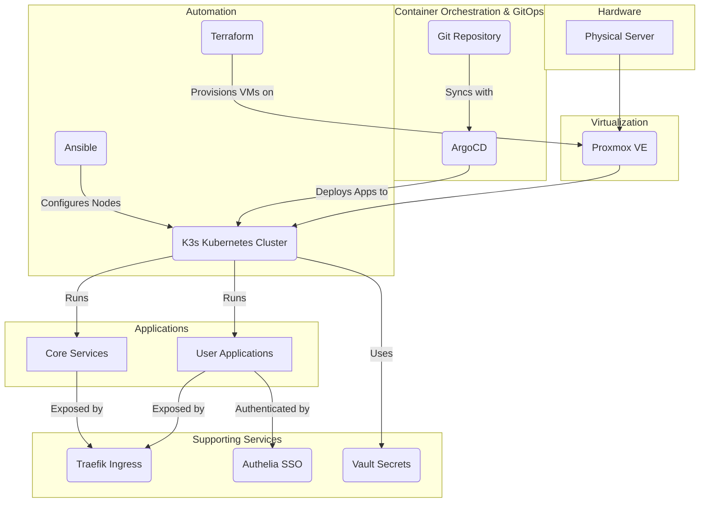

# Technical Design Document

## 1. Introduction

This document provides a detailed technical overview of the Homelabeazy project. The project's mission is to bring enterprise-grade automation to personal homelabs, providing a complete blueprint to build a powerful, reproducible server environment using professional Infrastructure as Code (IaC) and GitOps practices. This document delves into the architecture, components, and design decisions that make up this project.

## 2. Goals and Non-Goals

### 2.1. Goals

The primary goals of this project are:

- **Automation:** To automate the entire lifecycle of a homelab setup, from infrastructure provisioning to application deployment.
- **Reproducibility:** To ensure that the homelab environment can be torn down and rebuilt from scratch in a consistent and predictable manner.
- **Modularity:** To allow users to easily add or remove applications and components to suit their specific needs.
- **GitOps:** To use Git as the single source of truth for both infrastructure and applications, enabling a declarative approach to management.
- **Security:** To implement security best practices, including network segmentation, secrets management, and single sign-on.

### 2.2. Non-Goals

This project does not aim to:

- **Support other virtualization platforms:** The project is tightly coupled with Proxmox and does not support other hypervisors like ESXi or Hyper-V out of the box.
- **Be for Enterprise Production Use:** While using enterprise-grade practices, this project is intended for personal homelab use and is not recommended for production enterprise workloads without significant additional hardening and testing.
- **Provide a simplified setup for beginners:** While the goal is to automate, a certain level of technical understanding of the core components (Terraform, Ansible, Kubernetes) is expected.

## 3. High-Level Architecture

The architecture is a multi-layered system that builds upon a foundation of virtualization. It uses a combination of IaC and GitOps tools to automate the provisioning and configuration of a Kubernetes cluster and the applications that run on it. The diagram below provides a high-level overview of the system.

## 4. Detailed Component Design

### 4.1. Proxmox

Proxmox VE is the open-source virtualization platform that serves as the foundation of the homelab. It is used to create and manage the virtual machines that will form the Kubernetes cluster.

- **Prerequisites:** A working Proxmox installation is required.
- **VM Templates:** The project relies on a cloud-init compatible VM template to be present on the Proxmox server. This template is used by Terraform to clone new VMs. The template should be a minimal installation of a supported OS (e.g., Ubuntu Server).

### 4.2. Terraform

Terraform is used for Infrastructure as Code (IaC) to provision the virtual machines on Proxmox. The Terraform code is located in the `infrastructure/proxmox/` directory.

- **Configuration:** The main configuration file is `main.tf`, which defines the Proxmox provider and the VM resources.
- **Variables:** User-specific variables, such as Proxmox API credentials and VM specifications (CPU, memory, disk), are defined in `variables.tf` and should be set in a `terraform.tfvars` file (created from `terraform.tfvars.example`).
- **Execution:** Running `make terraform-apply` will execute the Terraform code and provision the VMs.

### 4.3. Ansible

Ansible is used for configuration management. After Terraform provisions the VMs, Ansible connects to them to perform initial setup, install K3s, and configure the nodes to form a cluster.

- **Inventory:** Ansible's inventory is located in `ansible/inventory/`. A static inventory file is provided for the user to fill in with the IP addresses of the newly created VMs.
- **Playbooks:** The main playbook for setting up the cluster is `ansible/playbooks/main.yml`. It calls various roles to perform specific tasks.
- **Roles:** The `ansible/roles/` directory contains reusable roles for tasks such as installing K3s (`k3s_cluster`), setting up applications (`applications`), and configuring system settings (`config`). This modular structure allows for easy extension and customization.
- **Execution:** Running `make ansible-playbook-setup` will run the main playbook against the inventory.

### 4.4. K3s Cluster

K3s is a lightweight, certified Kubernetes distribution that is used as the container orchestration platform. It is designed to be a single binary that is easy to install, manage, and scale.

- **Architecture:** The cluster consists of one or more master nodes and one or more worker nodes. The master node runs the Kubernetes control plane, while the worker nodes run the application workloads.
- **Installation:** K3s is installed by the `k3s_cluster` Ansible role. This role handles the installation of the K3s binary and the configuration of the cluster.
- **Storage:** The project is configured to use the default K3s storage provisioner (local-path-provisioner), which is suitable for single-node clusters or development environments. For multi-node clusters, a more robust storage solution like Longhorn or an NFS provisioner would be recommended.

### 4.5. ArgoCD

ArgoCD is a declarative, GitOps continuous delivery tool for Kubernetes. It is used to automate the deployment and lifecycle management of applications in the K3s cluster.

- **GitOps Workflow:** ArgoCD monitors the `apps/` directory in this Git repository. Any changes pushed to this directory are automatically synced to the cluster.
- **App of Apps Pattern:** The project uses the "app of apps" pattern. A single root application, defined in `apps/app-of-apps.yml`, is deployed to the cluster. This root app consists of other ArgoCD applications, each representing a service to be deployed. This allows for modular management of applications.
- **Customization:** To add a new application, you can create a new YAML file in the `apps/` directory, following the ArgoCD Application CRD format. ArgoCD will automatically pick it up and deploy it.

### 4.6. Networking

The project uses a VLAN-based network segmentation strategy to isolate traffic and enhance security.

#### 4.6.1. VLANs
VLANs (Virtual LANs) are used to create logical broadcast domains that are isolated from each other. This project defines the following VLANs:
- **VLAN 10 (Service Network):** For services running in the homelab, such as the K3s cluster.
- **VLAN 20 (Guest Network):** For guest devices, isolated from the rest of the network.
- **VLAN 30 (Management Network):** For managing Proxmox and other infrastructure.

#### 4.6.2. Traefik
Traefik is a modern reverse proxy and load balancer that is used as the Ingress controller for the K3s cluster.
- **Role:** It manages external access to the services running in the cluster, handling routing, SSL termination, and load balancing.
- **Configuration:** Traefik is deployed as part of the core services and is configured via Custom Resource Definitions (CRDs) in Kubernetes.

#### 4.6.3. Consul
Consul is used for service discovery within the cluster.
- **Role:** Services can be registered with Consul, allowing them to discover and communicate with each other using DNS. This is particularly useful for services that are not exposed via Ingress.

#### 4.6.4. pfSense
pfSense is a powerful open-source firewall and router that is used to manage the network.
- **Role:** It is responsible for routing traffic between VLANs and enforcing firewall rules to control access between the different network segments.

### 4.7. Security

Security is a key consideration in this project. The following components are used to secure the homelab:

#### 4.7.1. Vault
HashiCorp Vault is used for secrets management.
- **Role:** Vault provides a centralized and secure way to store and access secrets like API keys, passwords, and certificates. Applications can dynamically fetch their secrets from Vault, avoiding the need to store them in Git or in Kubernetes Secrets.
- **Integration:** Vault is integrated with Kubernetes and can inject secrets into pods using the Vault Secrets Operator.

#### 4.7.2. Authelia
Authelia is an open-source authentication and authorization server providing two-factor authentication and single sign-on (SSO).
- **Role:** It acts as a gatekeeper for applications, ensuring that only authenticated users can access them. It integrates with Traefik to protect services at the ingress level.
- **Backend:** Authelia uses OpenLDAP as its user database.

#### 4.7.3. OpenLDAP
OpenLDAP is used as the central user directory.
- **Role:** It stores user accounts and credentials, which are used by Authelia for authentication. This provides a single source of truth for user management.

### 4.8. Monitoring and Logging

A centralized logging solution is implemented using the EFK stack.

- **Components:**
    - **Elasticsearch:** A distributed search and analytics engine used to store and index logs.
    - **Fluentd:** A data collector that gathers logs from all the nodes and applications in the cluster and forwards them to Elasticsearch.
    - **Kibana:** A web interface for searching, analyzing, and visualizing the logs stored in Elasticsearch.
- **Benefits:** This setup provides a unified view of all logs, making it easier to troubleshoot issues and monitor the health of the system.

### 4.9. Backup and Recovery

Velero is used for backing up and restoring the Kubernetes cluster.

- **Functionality:** Velero can back up the entire cluster state, including all Kubernetes resources and persistent volumes.
- **Storage:** Backups are stored in an S3-compatible object store (e.g., Minio).
- **Recovery:** In the event of a cluster failure, Velero can be used to restore the cluster to a previous state from a backup.

## 5. Data Management

Persistent data for stateful applications is managed using Kubernetes Persistent Volumes (PVs) and Persistent Volume Claims (PVCs).

- **Storage Class:** The cluster uses the `local-path` storage class provided by K3s, which provisions storage from the local filesystem of the worker nodes.
- **Limitations:** This approach is simple but has limitations. If a node goes down, the data on that node becomes unavailable.
- **Recommendations:** For critical data, it is recommended to use a replicated storage solution like Longhorn or a shared storage solution like NFS or Ceph. This would require setting up a dedicated storage cluster or an NFS server and creating a new StorageClass.

## 6. Scalability

The cluster can be scaled horizontally to accommodate more applications and users.

- **Adding Worker Nodes:** To scale the cluster, you can provision new virtual machines using Terraform and then run the Ansible playbook to join them to the cluster as worker nodes.
- **Resource Allocation:** The resources (CPU, memory) of the VMs can also be scaled vertically by modifying the Terraform variables and re-provisioning the VMs.

## 7. Customization

This project is designed to be highly customizable. For detailed instructions on how to add your own applications, configure services, and modify the infrastructure, please refer to the [Customization Guide](customization.md).

## 8. Roadmap

This project is continuously evolving. Here are some potential future enhancements:

- **Multi-Cloud Support:** Adding support for other cloud providers like AWS, GCP, or Azure.
- **Advanced Networking:** Implementing more advanced networking policies using a service mesh like Istio or Linkerd.
- **High Availability:** Setting up a multi-master K3s cluster for high availability of the control plane.
- **Automated Backups:** Creating a more automated backup and restore workflow.
